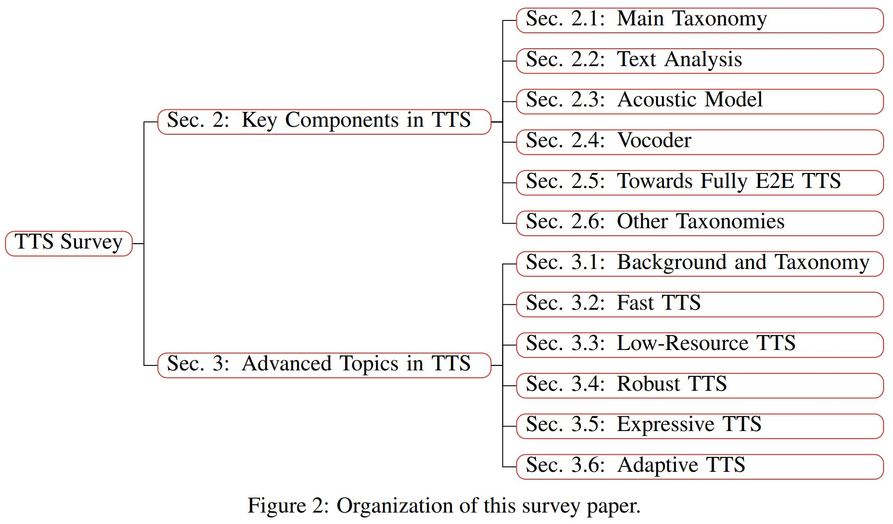
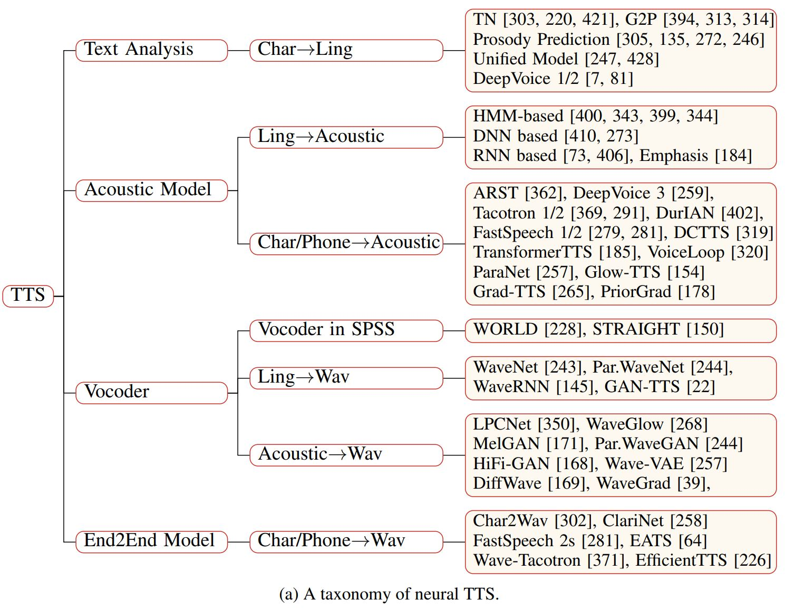
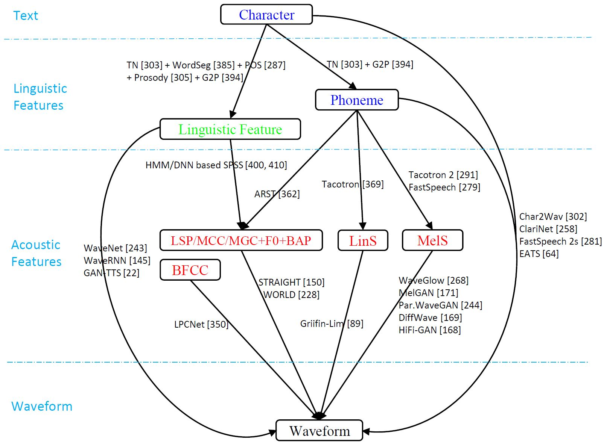
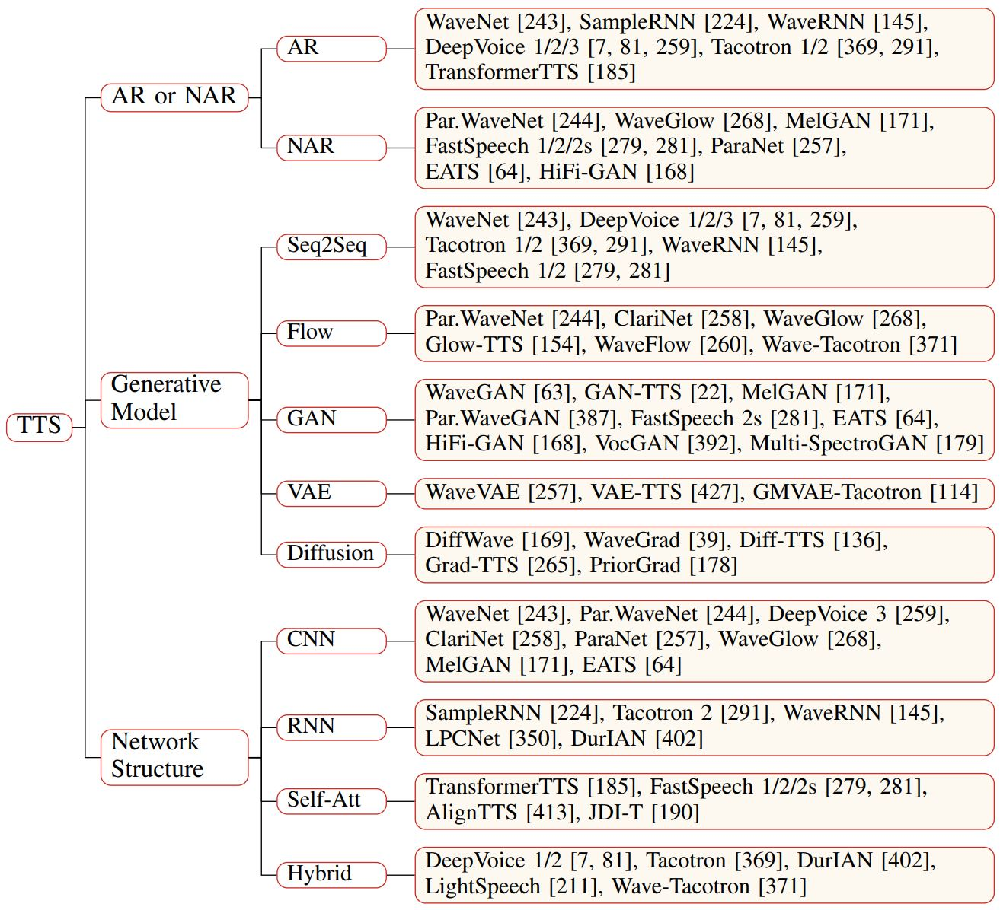
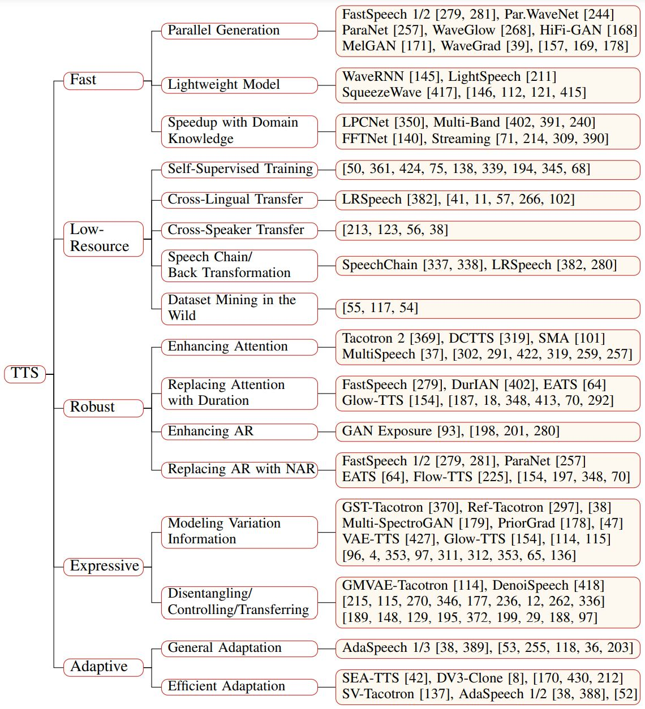
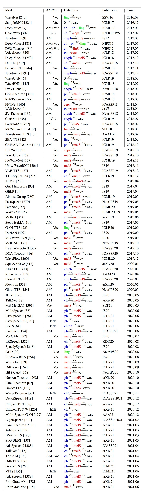

# [A Survey on Neural Speech Synthesis](#)
[Xu Tan](https://www.microsoft.com/en-us/research/people/xuta/), [Tao Qin](https://www.microsoft.com/en-us/research/people/taoqin/), [Tie-Yan Liu](https://www.microsoft.com/en-us/research/people/tyliu/)

## Introduction
Text to speech (TTS), or speech synthesis, which aims to synthesize intelligible and natural speech given text, has been a hot research topic in speech, language, and machine learning communities and has become an important commercial service in the industry. As the development of deep learning and artificial intelligence, neural network-based TTS has significantly improved the quality of synthesized speech in recent years. In this paper, we conduct a comprehensive survey on neural TTS, aiming to provide a good understanding of current research and future trends. We focus on the key components in neural TTS, including text analysis, acoustic models and vocoders, and several advanced topics, including fast TTS, low-resource TTS, robust TTS, expressive TTS, and adaptive TTS, etc. We further summarize resources related to TTS (e.g., datasets, opensource implementations), and discuss future research directions. This survey can serve both academic researchers and industry practitioners working on TTS. 

## Some Taxonomies and Paper Lists

1. Orgnization of this survey paper
 
2. Main taxonomy of TTS
 
3. TTS data flow
 
4. Other taxonomies
 
5. Category of adanced topics in TTS
 
6. Time evolution of TTS

<embed src="https://tts-tutorial.github.io/ijcai2021/TTS_time_flow.pdf" type="application/pdf" >
<object data="https://tts-tutorial.github.io/ijcai2021/TTS_time_flow.pdf" type="application/pdf" width="700px" height="700px">
    <embed src="https://tts-tutorial.github.io/ijcai2021/TTS_time_flow.pdf">
        
This browser does not support PDFs. Please download the PDF to view it: <a href="http://yoursite.com/the.pdf">Download PDF</a>.

    </embed>
</object>

7. A list of TTS models

Comments and suggestions are warmly welcomed!

## References
[1] Ronald Brian Adler, George R Rodman, and Alexandre Sévigny. Understanding human communication. Holt, Rinehart and Winston Chicago, 1991.  
[2] Vatsal Aggarwal, Marius Cotescu, Nishant Prateek, Jaime Lorenzo-Trueba, and Roberto BarraChicote. Using vaes and normalizing flows for one-shot text-to-speech synthesis of expressive speech. In ICASSP 2020-2020 IEEE International Conference on Acoustics, Speech and Signal Processing (ICASSP), pages 6179–6183. IEEE, 2020.  
[3] Yang Ai and Zhen-Hua Ling. A neural vocoder with hierarchical generation of amplitude and phase spectra for statistical parametric speech synthesis. IEEE/ACM Transactions on Audio, Speech, and Language Processing, 28:839–851, 2020.  
[4] Kei Akuzawa, Yusuke Iwasawa, and Yutaka Matsuo. Expressive speech synthesis via modeling expressions with variational autoencoder. Proc. Interspeech 2018, pages 3067–3071, 2018.  
[5] Jonathan Allen, Sharon Hunnicutt, Rolf Carlson, and Bjorn Granstrom. Mitalk-79: The 1979 mit text-to-speech system. The Journal of the Acoustical Society of America, 65(S1): S130–S130, 1979.  
[6] Rosana Ardila, Megan Branson, Kelly Davis, Michael Kohler, Josh Meyer, Michael Henretty, Reuben Morais, Lindsay Saunders, Francis Tyers, and Gregor Weber. Common voice: A massively-multilingual speech corpus. In Proceedings of The 12th Language Resources and Evaluation Conference, pages 4218–4222, 2020.  
[7] Sercan Ö Arık, Mike Chrzanowski, Adam Coates, Gregory Diamos, Andrew Gibiansky, Yongguo Kang, Xian Li, John Miller, Andrew Ng, Jonathan Raiman, et al. Deep voice: Real-time neural text-to-speech. In International Conference on Machine Learning, pages 195–204. PMLR, 2017.  
[8] Sercan Ö Arık, Jitong Chen, Kainan Peng, Wei Ping, and Yanqi Zhou. Neural voice cloning with a few samples. In Proceedings of the 32nd International Conference on Neural Information Processing Systems, pages 10040–10050, 2018.  
[9] Sercan Ö Arık, Heewoo Jun, and Gregory Diamos. Fast spectrogram inversion using multi-head convolutional neural networks. IEEE Signal Processing Letters, 26(1):94–98, 2018.  
[10] Adele Aubin, Alessandra Cervone, Oliver Watts, and Simon King. Improving speech synthesis with discourse relations. In INTERSPEECH, pages 4470–4474, 2019.  
[11] Kurniawati Azizah, Mirna Adriani, and Wisnu Jatmiko. Hierarchical transfer learning for multilingual, multi-speaker, and style transfer dnn-based tts on low-resource languages. IEEE Access, 8:179798–179812, 2020.  
[12] Jae-Sung Bae, Hanbin Bae, Young-Sun Joo, Junmo Lee, Gyeong-Hoon Lee, and Hoon-Young Cho. Speaking speed control of end-to-end speech synthesis using sentence-level conditioning. Proc. Interspeech 2020, pages 4402–4406, 2020.  
[13] Dzmitry Bahdanau, Kyunghyun Cho, and Yoshua Bengio. Neural machine translation by jointly learning to align and translate. arXiv preprint arXiv:1409.0473, 2014.  
[14] Data Baker. Chinese standard mandarin speech corpus. https://www.data-baker.com/open_source.html, 2017.  
[15] Evelina Bakhturina, Vitaly Lavrukhin, Boris Ginsburg, and Yang Zhang. Hi-fi multi-speaker english tts dataset. arXiv preprint arXiv:2104.01497, 2021.  
[16] Eric Battenberg, RJ Skerry-Ryan, Soroosh Mariooryad, Daisy Stanton, David Kao, Matt Shannon, and Tom Bagby. Location-relative attention mechanisms for robust long-form speech synthesis. In ICASSP 2020-2020 IEEE International Conference on Acoustics, Speech and Signal Processing (ICASSP), pages 6194–6198. IEEE, 2020.  
[17] Stanislav Beliaev and Boris Ginsburg. Talknet 2: Non-autoregressive depth-wise separable convolutional model for speech synthesis with explicit pitch and duration prediction. arXiv preprint arXiv:2104.08189, 2021.  
[18] Stanislav Beliaev, Yurii Rebryk, and Boris Ginsburg. Talknet: Fully-convolutional nonautoregressive speech synthesis model. arXiv preprint arXiv:2005.05514, 2020.  
[19] Samy Bengio, Oriol Vinyals, Navdeep Jaitly, and Noam Shazeer. Scheduled sampling for sequence prediction with recurrent neural networks. In Proceedings of the 28th International Conference on Neural Information Processing Systems-Volume 1, pages 1171–1179, 2015.  
[20] Yoshua Bengio. Deep generative models for speech and images. https://www.youtube.com/watch?v=vEAq_sBf1CA, 2017.  
[21] Mengxiao Bi, Heng Lu, Shiliang Zhang, Ming Lei, and Zhijie Yan. Deep feed-forward sequential memory networks for speech synthesis. In 2018 IEEE International Conference on Acoustics, Speech and Signal Processing (ICASSP), pages 4794–4798. IEEE, 2018.  
[22] Mikołaj Binkowski, Jeff Donahue, Sander Dieleman, Aidan Clark, Erich Elsen, Norman ´ Casagrande, Luis C Cobo, and Karen Simonyan. High fidelity speech synthesis with adversarial networks. In International Conference on Learning Representations, 2019.  
[23] Maximilian Bisani and Hermann Ney. Joint-sequence models for grapheme-to-phoneme conversion. Speech communication, 50(5):434–451, 2008.  
[24] Christopher M Bishop. Pattern recognition and machine learning. springer, 2006.  
[25] Alan Black, Paul Taylor, Richard Caley, and Rob Clark. The festival speech synthesis system, 1998.  
[26] Alan W Black, Heiga Zen, and Keiichi Tokuda. Statistical parametric speech synthesis. In 2007 IEEE International Conference on Acoustics, Speech and Signal Processing-ICASSP’07, volume 4, pages IV–1229. IEEE, 2007.  
[27] Hui Bu, Jiayu Du, Xingyu Na, Bengu Wu, and Hao Zheng. Aishell-1: An open-source mandarin speech corpus and a speech recognition baseline. In 2017 20th Conference of the Oriental Chapter of the International Coordinating Committee on Speech Databases and Speech I/O Systems and Assessment (O-COCOSDA), pages 1–5. IEEE, 2017. 
[28] Zexin Cai, Yaogen Yang, Chuxiong Zhang, Xiaoyi Qin, and Ming Li. Polyphone disambiguation for mandarin chinese using conditional neural network with multi-level embedding features. Proc. Interspeech 2019, pages 2110–2114, 2019.  
[29] Zexin Cai, Chuxiong Zhang, and Ming Li. From speaker verification to multispeaker speech synthesis, deep transfer with feedback constraint. Proc. Interspeech 2020, pages 3974–3978, 2020.  
[30] Alexandra Canavan, Graff David, and Zipperlen George. Callhome american english speech. https://catalog.ldc.upenn.edu/LDC97S42, 2021.  
[31] Edresson Casanova, Christopher Shulby, Eren Gölge, Nicolas Michael Müller, Frederico Santos de Oliveira, Arnaldo Candido Junior, Anderson da Silva Soares, Sandra Maria Aluisio, and Moacir Antonelli Ponti. Sc-glowtts: an efficient zero-shot multi-speaker text-to-speech model. arXiv preprint arXiv:2104.05557, 2021.  
[32] Moon-Jung Chae, Kyubyong Park, Jinhyun Bang, Soobin Suh, Jonghyuk Park, Namju Kim, and Longhun Park. Convolutional sequence to sequence model with non-sequential greedy decoding for grapheme to phoneme conversion. In 2018 IEEE International Conference on Acoustics, Speech and Signal Processing (ICASSP), pages 2486–2490. IEEE, 2018.  
[33] William Chan, Navdeep Jaitly, Quoc Le, and Oriol Vinyals. Listen, attend and spell: A neural network for large vocabulary conversational speech recognition. In Acoustics, Speech and Signal Processing (ICASSP), 2016 IEEE International Conference on, pages 4960–4964. IEEE, 2016.  
[34] Jiawei Chen, Xu Tan, Jian Luan, Tao Qin, and Tie-Yan Liu. Hifisinger: Towards high-fidelity neural singing voice synthesis. arXiv preprint arXiv:2009.01776, 2020.  
[35] Lele Chen, Guofeng Cui, Ziyi Kou, Haitian Zheng, and Chenliang Xu. What comprises a good talking-head video generation?: A survey and benchmark. arXiv preprint arXiv:2005.03201, 2020.  
[36] Mengnan Chen, Minchuan Chen, Shuang Liang, Jun Ma, Lei Chen, Shaojun Wang, and Jing Xiao. Cross-lingual, multi-speaker text-to-speech synthesis using neural speaker embedding. Proc. Interspeech 2019, pages 2105–2109, 2019.  
[37] Mingjian Chen, Xu Tan, Yi Ren, Jin Xu, Hao Sun, Sheng Zhao, and Tao Qin. Multispeech: Multi-speaker text to speech with transformer. In INTERSPEECH, pages 4024–4028, 2020.  
[38] Mingjian Chen, Xu Tan, Bohan Li, Yanqing Liu, Tao Qin, sheng zhao, and Tie-Yan Liu. Adaspeech: Adaptive text to speech for custom voice. In International Conference on Learning Representations, 2021. URL https://openreview.net/forum?id=Drynvt7gg4L.  
[39] Nanxin Chen, Yu Zhang, Heiga Zen, Ron J Weiss, Mohammad Norouzi, and William Chan. Wavegrad: Estimating gradients for waveform generation. In ICLR, 2021.  
[40] Stanley F Chen. Conditional and joint models for grapheme-to-phoneme conversion. In Eighth European Conference on Speech Communication and Technology, 2003.  
[41] Yuan-Jui Chen, Tao Tu, Cheng-chieh Yeh, and Hung-Yi Lee. End-to-end text-to-speech for low-resource languages by cross-lingual transfer learning. Proc. Interspeech 2019, pages 2075–2079, 2019.  
[42] Yutian Chen, Yannis Assael, Brendan Shillingford, David Budden, Scott Reed, Heiga Zen, Quan Wang, Luis C Cobo, Andrew Trask, Ben Laurie, et al. Sample efficient adaptive text-to-speech. In International Conference on Learning Representations, 2018.  
[43] Chung-Ming Chien and Hung-yi Lee. Hierarchical prosody modeling for non-autoregressive speech synthesis. In 2021 IEEE Spoken Language Technology Workshop (SLT), pages 446–453. IEEE, 2021.  
[44] Chung-Ming Chien, Jheng-Hao Lin, Chien-yu Huang, Po-chun Hsu, and Hung-yi Lee. Investigating on incorporating pretrained and learnable speaker representations for multi-speaker multi-style text-to-speech. arXiv preprint arXiv:2103.04088, 2021. 
[45] Chung-Cheng Chiu and Colin Raffel. Monotonic chunkwise attention. In International Conference on Learning Representations, 2018.  
[46] Chung-Cheng Chiu, Tara N Sainath, Yonghui Wu, Rohit Prabhavalkar, Patrick Nguyen, Zhifeng Chen, Anjuli Kannan, Ron J Weiss, Kanishka Rao, Ekaterina Gonina, et al. State-of-the-art speech recognition with sequence-to-sequence models. In 2018 IEEE International Conference on Acoustics, Speech and Signal Processing (ICASSP), pages 4774–4778. IEEE, 2018.  
[47] Seungwoo Choi, Seungju Han, Dongyoung Kim, and Sungjoo Ha. Attentron: Few-shot text-to-speech utilizing attention-based variable-length embedding. Proc. Interspeech 2020, pages 2007–2011, 2020.  
[48] Jan Chorowski, Dzmitry Bahdanau, Dmitriy Serdyuk, Kyunghyun Cho, and Yoshua Bengio. Attention-based models for speech recognition. In Proceedings of the 28th International Conference on Neural Information Processing Systems-Volume 1, pages 577–585, 2015.  
[49] Min Chu and Yao Qian. Locating boundaries for prosodic constituents in unrestricted mandarin texts. In International Journal of Computational Linguistics & Chinese Language Processing, Volume 6, Number 1, February 2001: Special Issue on Natural Language Processing Researches in MSRA, pages 61–82, 2001.  
[50] Yu-An Chung, Yuxuan Wang, Wei-Ning Hsu, Yu Zhang, and RJ Skerry-Ryan. Semi-supervised training for improving data efficiency in end-to-end speech synthesis. In ICASSP 2019-2019 IEEE International Conference on Acoustics, Speech and Signal Processing (ICASSP), pages 6940–6944. IEEE, 2019.  
[51] Jian Cong, Shan Yang, Lei Xie, Guoqiao Yu, and Guanglu Wan. Data efficient voice cloning from noisy samples with domain adversarial training. Proc. Interspeech 2020, pages 811–815, 2020.  
[52] Erica Cooper, Cheng-I Lai, Yusuke Yasuda, Fuming Fang, Xin Wang, Nanxin Chen, and Junichi Yamagishi. Zero-shot multi-speaker text-to-speech with state-of-the-art neural speaker embeddings. In ICASSP 2020-2020 IEEE International Conference on Acoustics, Speech and Signal Processing (ICASSP), pages 6184–6188. IEEE, 2020.  
[53] Erica Cooper, Cheng-I Lai, Yusuke Yasuda, and Junichi Yamagishi. Can speaker augmentation improve multi-speaker end-to-end tts? Proc. Interspeech 2020, pages 3979–3983, 2020.  
[54] Erica Cooper, Xin Wang, Yi Zhao, Yusuke Yasuda, and Junichi Yamagishi. Pretraining strategies, waveform model choice, and acoustic configurations for multi-speaker end-to-end speech synthesis. arXiv preprint arXiv:2011.04839, 2020.  
[55] Erica Lindsay Cooper. Text-to-speech synthesis using found data for low-resource languages. PhD thesis, Columbia University, 2019.  
[56] Dongyang Dai, Li Chen, Yuping Wang, Mu Wang, Rui Xia, Xuchen Song, Zhiyong Wu, and Yuxuan Wang. Noise robust tts for low resource speakers using pre-trained model and speech enhancement. arXiv preprint arXiv:2005.12531, 2020.  
[57] Marcel de Korte, Jaebok Kim, and Esther Klabbers. Efficient neural speech synthesis for lowresource languages through multilingual modeling. Proc. Interspeech 2020, pages 2967–2971, 2020.  
[58] Ferdinand De Saussure. Course in general linguistics. Columbia University Press, 2011.  
[59] Chuang Ding, Lei Xie, Jie Yan, Weini Zhang, and Yang Liu. Automatic prosody prediction for chinese speech synthesis using blstm-rnn and embedding features. In 2015 IEEE Workshop on Automatic Speech Recognition and Understanding (ASRU), pages 98–102. IEEE, 2015.  
[60] Laurent Dinh, David Krueger, and Yoshua Bengio. Nice: Non-linear independent components estimation. arXiv preprint arXiv:1410.8516, 2014.  
[61] Laurent Dinh, Jascha Sohl-Dickstein, and Samy Bengio. Density estimation using real nvp. arXiv preprint arXiv:1605.08803, 2016. 40 
[62] Rama Doddipatla, Norbert Braunschweiler, and Ranniery Maia. Speaker adaptation in dnnbased speech synthesis using d-vectors. In INTERSPEECH, pages 3404–3408, 2017.  
[63] Chris Donahue, Julian McAuley, and Miller Puckette. Adversarial audio synthesis. In International Conference on Learning Representations, 2018.  
[64] Jeff Donahue, Sander Dieleman, Mikołaj Binkowski, Erich Elsen, and Karen Simonyan. ´ End-to-end adversarial text-to-speech. In ICLR, 2021.  
[65] Chenpeng Du and Kai Yu. Mixture density network for phone-level prosody modelling in speech synthesis. arXiv preprint arXiv:2102.00851, 2021.  
[66] Jiayu Du, Xingyu Na, Xuechen Liu, and Hui Bu. Aishell-2: Transforming mandarin asr research into industrial scale. arXiv preprint arXiv:1808.10583, 2018.  
[67] Homer Dudley and Thomas H Tarnoczy. The speaking machine of wolfgang von kempelen. The Journal of the Acoustical Society of America, 22(2):151–166, 1950.  
[68] Ewan Dunbar, Robin Algayres, Julien Karadayi, Mathieu Bernard, Juan Benjumea, Xuan-Nga Cao, Lucie Miskic, Charlotte Dugrain, Lucas Ondel, Alan W Black, et al. The zero resource speech challenge 2019: Tts without t. Proc. Interspeech 2019, pages 1088–1092, 2019.  
[69] Isaac Elias, Heiga Zen, Jonathan Shen, Yu Zhang, Ye Jia, Ron Weiss, and Yonghui Wu. Parallel tacotron: Non-autoregressive and controllable tts. arXiv preprint arXiv:2010.11439, 2020.  
[70] Isaac Elias, Heiga Zen, Jonathan Shen, Yu Zhang, Jia Ye, RJ Ryan, and Yonghui Wu. Parallel tacotron 2: A non-autoregressive neural tts model with differentiable duration modeling. arXiv preprint arXiv:2103.14574, 2021.  
[71] Nikolaos Ellinas, Georgios Vamvoukakis, Konstantinos Markopoulos, Aimilios Chalamandaris, Georgia Maniati, Panos Kakoulidis, Spyros Raptis, June Sig Sung, Hyoungmin Park, and Pirros Tsiakoulis. High quality streaming speech synthesis with low, sentence-length-independent latency. Proc. Interspeech 2020, pages 2022–2026, 2020.  
[72] Jesse Engel, Chenjie Gu, Adam Roberts, et al. Ddsp: Differentiable digital signal processing. In International Conference on Learning Representations, 2019.  
[73] Yuchen Fan, Yao Qian, Feng-Long Xie, and Frank K Soong. Tts synthesis with bidirectional lstm based recurrent neural networks. In Fifteenth annual conference of the international speech communication association, 2014.  
[74] Yuchen Fan, Yao Qian, Frank K Soong, and Lei He. Multi-speaker modeling and speaker adaptation for dnn-based tts synthesis. In 2015 IEEE International Conference on Acoustics, Speech and Signal Processing (ICASSP), pages 4475–4479. IEEE, 2015.  
[75] Wei Fang, Yu-An Chung, and James Glass. Towards transfer learning for end-to-end speech synthesis from deep pre-trained language models. arXiv preprint arXiv:1906.07307, 2019.  
[76] Toshiaki Fukada, Keiichi Tokuda, Takao Kobayashi, and Satoshi Imai. An adaptive algorithm for mel-cepstral analysis of speech. In Proc. ICASSP, volume 1, pages 137–140, 1992.  
[77] Lenar Gabdrakhmanov, Rustem Garaev, and Evgenii Razinkov. Ruslan: Russian spoken language corpus for speech synthesis. In International Conference on Speech and Computer, pages 113–121. Springer, 2019.  
[78] Michael Gadermayr, Maximilian Tschuchnig, Laxmi Gupta, Nils Krämer, Daniel Truhn, D Merhof, and Burkhard Gess. An asymmetric cycle-consistency loss for dealing with many-to-one mappings in image translation: a study on thigh mr scans. In 2021 IEEE 18th International Symposium on Biomedical Imaging (ISBI), pages 1182–1186. IEEE, 2021.  
[79] Yang Gao, Weiyi Zheng, Zhaojun Yang, Thilo Kohler, Christian Fuegen, and Qing He. Interactive text-to-speech via semi-supervised style transfer learning. arXiv preprint arXiv:2002.06758, 2020. 41 
[80] Saeed Gazor and Wei Zhang. Speech probability distribution. IEEE Signal Processing Letters, 10(7):204–207, 2003.  
[81] Andrew Gibiansky, Sercan Ömer Arik, Gregory Frederick Diamos, John Miller, Kainan Peng, Wei Ping, Jonathan Raiman, and Yanqi Zhou. Deep voice 2: Multi-speaker neural text-to-speech. In NIPS, 2017.  
[82] Munich Artificial Intelligence Laboratories GmbH. The m-ailabs speech dataset. https: //www.caito.de/2019/01/the-m-ailabs-speech-dataset/, 2019.  
[83] Ian Goodfellow, Yoshua Bengio, Aaron Courville, and Yoshua Bengio. Deep learning, volume 1. MIT press Cambridge, 2016.  
[84] Ian J Goodfellow, Jean Pouget-Abadie, Mehdi Mirza, Bing Xu, David Warde-Farley, Sherjil Ozair, Aaron C Courville, and Yoshua Bengio. Generative adversarial nets. In NIPS, 2014.  
[85] Prachi Govalkar, Johannes Fischer, Frank Zalkow, and Christian Dittmar. A comparison of recent neural vocoders for speech signal reconstruction. In Proc. 10th ISCA Speech Synthesis Workshop, pages 7–12, 2019.  
[86] Anirudh Goyal, Alex Lamb, Ying Zhang, Saizheng Zhang, Aaron Courville, and Yoshua Bengio. Professor forcing: a new algorithm for training recurrent networks. In Proceedings of the 30th International Conference on Neural Information Processing Systems, pages 4608– 4616, 2016.  
[87] Alex Graves. Generating sequences with recurrent neural networks. arXiv preprint arXiv:1308.0850, 2013.  
[88] Alex Graves, Santiago Fernández, Faustino Gomez, and Jürgen Schmidhuber. Connectionist temporal classification: labelling unsegmented sequence data with recurrent neural networks. In Proceedings of the 23rd international conference on Machine learning, pages 369–376, 2006.  
[89] Daniel Griffin and Jae Lim. Signal estimation from modified short-time fourier transform. IEEE Transactions on Acoustics, Speech, and Signal Processing, 32(2):236–243, 1984.  
[90] Alexey Gritsenko, Tim Salimans, Rianne van den Berg, Jasper Snoek, and Nal Kalchbrenner. A spectral energy distance for parallel speech synthesis. Advances in Neural Information Processing Systems, 33, 2020.  
[91] Ishaan Gulrajani, Faruk Ahmed, Martin Arjovsky, Vincent Dumoulin, and Aaron Courville. Improved training of wasserstein gans. In Proceedings of the 31st International Conference on Neural Information Processing Systems, pages 5769–5779, 2017.  
[92] Haohan Guo, Frank K Soong, Lei He, and Lei Xie. Exploiting syntactic features in a parsed tree to improve end-to-end tts. Proc. Interspeech 2019, pages 4460–4464, 2019.  
[93] Haohan Guo, Frank K Soong, Lei He, and Lei Xie. A new gan-based end-to-end tts training algorithm. Proc. Interspeech 2019, pages 1288–1292, 2019.  
[94] Tingwei Guo, Cheng Wen, Dongwei Jiang, Ne Luo, Ruixiong Zhang, Shuaijiang Zhao, Wubo Li, Cheng Gong, Wei Zou, Kun Han, et al. Didispeech: A large scale mandarin speech corpus. arXiv preprint arXiv:2010.09275, 2020.  
[95] Weitong Guo, Hongwu Yang, and Zhenye Gan. A dnn-based mandarin-tibetan cross-lingual speech synthesis. In 2018 Asia-Pacific Signal and Information Processing Association Annual Summit and Conference (APSIPA ASC), pages 1702–1707. IEEE, 2018.  
[96] Siddharth Gururani, Kilol Gupta, Dhaval Shah, Zahra Shakeri, and Jervis Pinto. Prosody transfer in neural text to speech using global pitch and loudness features. arXiv preprint arXiv:1911.09645, 2019.  
[97] Raza Habib, Soroosh Mariooryad, Matt Shannon, Eric Battenberg, RJ Skerry-Ryan, Daisy Stanton, David Kao, and Tom Bagby. Semi-supervised generative modeling for controllable speech synthesis. In International Conference on Learning Representations, 2019. 42 
[98] Tomoki Hayashi, Shinji Watanabe, Tomoki Toda, Kazuya Takeda, Shubham Toshniwal, and Karen Livescu. Pre-trained text embeddings for enhanced text-to-speech synthesis. Proc. Interspeech 2019, pages 4430–4434, 2019.  
[99] Tomoki Hayashi, Ryuichi Yamamoto, Katsuki Inoue, Takenori Yoshimura, Shinji Watanabe, Tomoki Toda, Kazuya Takeda, Yu Zhang, and Xu Tan. Espnet-tts: Unified, reproducible, and integratable open source end-to-end text-to-speech toolkit. In ICASSP 2020-2020 IEEE International Conference on Acoustics, Speech and Signal Processing (ICASSP), pages 7654– 7658. IEEE, 2020.  
[100] Fei He, Shan-Hui Cathy Chu, Oddur Kjartansson, Clara Rivera, Anna Katanova, Alexander Gutkin, Isin Demirsahin, Cibu Johny, Martin Jansche, Supheakmungkol Sarin, et al. Opensource multi-speaker speech corpora for building gujarati, kannada, malayalam, marathi, tamil and telugu speech synthesis systems. In Proceedings of The 12th Language Resources and Evaluation Conference, pages 6494–6503, 2020.  
[101] Mutian He, Yan Deng, and Lei He. Robust sequence-to-sequence acoustic modeling with stepwise monotonic attention for neural tts. pages 1293–1297, 2019.  
[102] Mutian He, Jingzhou Yang, and Lei He. Multilingual byte2speech text-to-speech models are few-shot spoken language learners. arXiv preprint arXiv:2103.03541, 2021.  
[103] Hamed Hemati and Damian Borth. Using ipa-based tacotron for data efficient cross-lingual speaker adaptation and pronunciation enhancement. arXiv preprint arXiv:2011.06392, 2020.  
[104] Ivan Himawan, Sandesh Aryal, Iris Ouyang, Sam Kang, Pierre Lanchantin, and Simon King. Speaker adaptation of a multilingual acoustic model for cross-language synthesis. In ICASSP 2020-2020 IEEE International Conference on Acoustics, Speech and Signal Processing (ICASSP), pages 7629–7633. IEEE, 2020.  
[105] Geoffrey Hinton, Oriol Vinyals, and Jeff Dean. Distilling the knowledge in a neural network. arXiv preprint arXiv:1503.02531, 2015.  
[106] Daniel Hirst. Automatic analysis of prosody for multilingual speech corpora. Improvements in speech synthesis, pages 320–327, 2001.  
[107] Jonathan Ho, Ajay Jain, and Pieter Abbeel. Denoising diffusion probabilistic models. arXiv preprint arXiv:2006.11239, 2020.  
[108] Sepp Hochreiter and Jürgen Schmidhuber. Long short-term memory. Neural computation, 9 (8):1735–1780, 1997.  
[109] Yukiya Hono, Kei Hashimoto, Keiichiro Oura, Yoshihiko Nankaku, and Keiichi Tokuda. Singing voice synthesis based on generative adversarial networks. In ICASSP 2019-2019 IEEE International Conference on Acoustics, Speech and Signal Processing (ICASSP), pages 6955–6959. IEEE, 2019.  
[110] Yukiya Hono, Kazuna Tsuboi, Kei Sawada, Kei Hashimoto, Keiichiro Oura, Yoshihiko Nankaku, and Keiichi Tokuda. Hierarchical multi-grained generative model for expressive speech synthesis. Proc. Interspeech 2020, pages 3441–3445, 2020.  
[111] Alain Hore and Djemel Ziou. Image quality metrics: Psnr vs. ssim. In 2010 20th international conference on pattern recognition, pages 2366–2369. IEEE, 2010.  
[112] Po-chun Hsu and Hung-yi Lee. Wg-wavenet: Real-time high-fidelity speech synthesis without gpu. Proc. Interspeech 2020, pages 210–214, 2020.  
[113] Po-chun Hsu, Chun-hsuan Wang, Andy T Liu, and Hung-yi Lee. Towards robust neural vocoding for speech generation: A survey. arXiv preprint arXiv:1912.02461, 2019.  
[114] Wei-Ning Hsu, Yu Zhang, Ron J Weiss, Heiga Zen, Yonghui Wu, Yuxuan Wang, Yuan Cao, Ye Jia, Zhifeng Chen, Jonathan Shen, et al. Hierarchical generative modeling for controllable speech synthesis. In International Conference on Learning Representations, 2018. 43 
[115] Wei-Ning Hsu, Yu Zhang, Ron J Weiss, Yu-An Chung, Yuxuan Wang, Yonghui Wu, and James Glass. Disentangling correlated speaker and noise for speech synthesis via data augmentation and adversarial factorization. In ICASSP 2019-2019 IEEE International Conference on Acoustics, Speech and Signal Processing (ICASSP), pages 5901–5905. IEEE, 2019.  
[116] Cheng-Hung Hu, Yi-Chiao Wu, Wen-Chin Huang, Yu-Huai Peng, Yu-Wen Chen, Pin-Jui Ku, Tomoki Toda, Yu Tsao, and Hsin-Min Wang. The as-nu system for the m2voc challenge. arXiv preprint arXiv:2104.03009, 2021.  
[117] Qiong Hu, Erik Marchi, David Winarsky, Yannis Stylianou, Devang Naik, and Sachin Kajarekar. Neural text-to-speech adaptation from low quality public recordings. In Speech Synthesis Workshop, volume 10, 2019.  
[118] Qiong Hu, Tobias Bleisch, Petko Petkov, Tuomo Raitio, Erik Marchi, and Varun Lakshminarasimhan. Whispered and lombard neural speech synthesis. In 2021 IEEE Spoken Language Technology Workshop (SLT), pages 454–461. IEEE, 2021.  
[119] Chin-Wei Huang, David Krueger, Alexandre Lacoste, and Aaron Courville. Neural autoregressive flows. In International Conference on Machine Learning, pages 2078–2087. PMLR, 2018.  
[120] Zhiying Huang, Heng Lu, Ming Lei, and Zhijie Yan. Linear networks based speaker adaptation for speech synthesis. In 2018 IEEE International Conference on Acoustics, Speech and Signal Processing (ICASSP), pages 5319–5323. IEEE, 2018.  
[121] Zhiying Huang, Hao Li, and Ming Lei. Devicetts: A small-footprint, fast, stable network for on-device text-to-speech. arXiv preprint arXiv:2010.15311, 2020.  
[122] Andrew J Hunt and Alan W Black. Unit selection in a concatenative speech synthesis system using a large speech database. In 1996 IEEE International Conference on Acoustics, Speech, and Signal Processing Conference Proceedings, volume 1, pages 373–376. IEEE, 1996.  
[123] Goeric Huybrechts, Thomas Merritt, Giulia Comini, Bartek Perz, Raahil Shah, and Jaime Lorenzo-Trueba. Low-resource expressive text-to-speech using data augmentation. arXiv preprint arXiv:2011.05707, 2020.  
[124] Min-Jae Hwang, Eunwoo Song, Ryuichi Yamamoto, Frank Soong, and Hong-Goo Kang. Improving lpcnet-based text-to-speech with linear prediction-structured mixture density network. In ICASSP 2020-2020 IEEE International Conference on Acoustics, Speech and Signal Processing (ICASSP), pages 7219–7223. IEEE, 2020.  
[125] Min-Jae Hwang, Ryuichi Yamamoto, Eunwoo Song, and Jae-Min Kim. Tts-by-tts: Tts-driven data augmentation for fast and high-quality speech synthesis. arXiv preprint arXiv:2010.13421, 2020.  
[126] Satoshi Imai. Cepstral analysis synthesis on the mel frequency scale. In ICASSP’83. IEEE International Conference on Acoustics, Speech, and Signal Processing, volume 8, pages 93–96. IEEE, 1983.  
[127] Satoshi Imai, Kazuo Sumita, and Chieko Furuichi. Mel log spectrum approximation (mlsa) filter for speech synthesis. Electronics and Communications in Japan (Part I: Communications), 66(2):10–18, 1983.  
[128] Katsuki Inoue, Sunao Hara, Masanobu Abe, Tomoki Hayashi, Ryuichi Yamamoto, and Shinji Watanabe. Semi-supervised speaker adaptation for end-to-end speech synthesis with pretrained models. In ICASSP 2020-2020 IEEE International Conference on Acoustics, Speech and Signal Processing (ICASSP), pages 7634–7638. IEEE, 2020.  
[129] Katsuki Inoue, Sunao Hara, Masanobu Abe, Nobukatsu Hojo, and Yusuke Ijima. Model architectures to extrapolate emotional expressions in dnn-based text-to-speech. Speech Communication, 126:35–43, 2021.  
[130] Fumitada Itakura. Line spectrum representation of linear predictor coefficients of speech signals. The Journal of the Acoustical Society of America, 57(S1):S35–S35, 1975. 44 
[131] Keith Ito. The lj speech dataset. https://keithito.com/LJ-Speech-Dataset/, 2017.  
[132] Won Jang, Dan Lim, and Jaesam Yoon. Universal melgan: A robust neural vocoder for high-fidelity waveform generation in multiple domains. arXiv preprint arXiv:2011.09631, 2020.  
[133] Artur Janicki. Application of neural networks for pos tagging and intonation control in speech synthesis for polish. Soft Computing and Intelligent Systems (SCIS 2004), 7, 2004.  
[134] Chrisina Jayne, Andreas Lanitis, and Chris Christodoulou. One-to-many neural network mapping techniques for face image synthesis. Expert Systems with Applications, 39(10): 9778–9787, 2012.  
[135] Je Hun Jeon and Yang Liu. Automatic prosodic events detection using syllable-based acoustic and syntactic features. In 2009 IEEE International Conference on Acoustics, Speech and Signal Processing, pages 4565–4568. IEEE, 2009.  
[136] Myeonghun Jeong, Hyeongju Kim, Sung Jun Cheon, Byoung Jin Choi, and Nam Soo Kim. Diff-tts: A denoising diffusion model for text-to-speech. arXiv preprint arXiv:2104.01409, 2021.  
[137] Ye Jia, Yu Zhang, Ron J Weiss, Quan Wang, Jonathan Shen, Fei Ren, Zhifeng Chen, Patrick Nguyen, Ruoming Pang, Ignacio Lopez Moreno, et al. Transfer learning from speaker verification to multispeaker text-to-speech synthesis. In Proceedings of the 32nd International Conference on Neural Information Processing Systems, pages 4485–4495, 2018.  
[138] Ye Jia, Heiga Zen, Jonathan Shen, Yu Zhang, and Yonghui Wu. Png bert: Augmented bert on phonemes and graphemes for neural tts. arXiv preprint arXiv:2103.15060, 2021.  
[139] Yunlong Jiao, Adam Gabrys, Georgi Tinchev, Bartosz Putrycz, Daniel Korzekwa, and Viacheslav Klimkov. Universal neural vocoding with parallel wavenet. arXiv preprint arXiv:2102.01106, 2021.  
[140] Zeyu Jin, Adam Finkelstein, Gautham J Mysore, and Jingwan Lu. Fftnet: A real-time speakerdependent neural vocoder. In 2018 IEEE International Conference on Acoustics, Speech and Signal Processing (ICASSP), pages 2251–2255. IEEE, 2018.  
[141] Michael I Jordan and Tom M Mitchell. Machine learning: Trends, perspectives, and prospects. Science, 349(6245):255–260, 2015.  
[142] Dan Jurafsky. Speech & language processing. Pearson Education India, 2000.  
[143] Lauri Juvela, Bajibabu Bollepalli, Vassilis Tsiaras, and Paavo Alku. Glotnet—a raw waveform model for the glottal excitation in statistical parametric speech synthesis. IEEE/ACM Transactions on Audio, Speech, and Language Processing, 27(6):1019–1030, 2019.  
[144] Lauri Juvela, Bajibabu Bollepalli, Junichi Yamagishi, and Paavo Alku. Gelp: Gan-excited linear prediction for speech synthesis from mel-spectrogram. Proc. Interspeech 2019, pages 694–698, 2019.  
[145] Nal Kalchbrenner, Erich Elsen, Karen Simonyan, Seb Noury, Norman Casagrande, Edward Lockhart, Florian Stimberg, Aaron Oord, Sander Dieleman, and Koray Kavukcuoglu. Efficient neural audio synthesis. In International Conference on Machine Learning, pages 2410–2419. PMLR, 2018.  
[146] Hiroki Kanagawa and Yusuke Ijima. Lightweight lpcnet-based neural vocoder with tensor decomposition. Proc. Interspeech 2020, pages 205–209, 2020.  
[147] Minsu Kang, Jihyun Lee, Simin Kim, and Injung Kim. Fast dctts: Efficient deep convolutional text-to-speech. arXiv preprint arXiv:2104.00624, 2021.  
[148] Sri Karlapati, Alexis Moinet, Arnaud Joly, Viacheslav Klimkov, Daniel Sáez-Trigueros, and Thomas Drugman. Copycat: Many-to-many fine-grained prosody transfer for neural text-tospeech. Proc. Interspeech 2020, pages 4387–4391, 2020. 45 
[149] Kyle Kastner, João Felipe Santos, Yoshua Bengio, and Aaron Courville. Representation mixing for tts synthesis. In ICASSP 2019-2019 IEEE International Conference on Acoustics, Speech and Signal Processing (ICASSP), pages 5906–5910. IEEE, 2019.  
[150] Hideki Kawahara. Straight, exploitation of the other aspect of vocoder: Perceptually isomorphic decomposition of speech sounds. Acoustical science and technology, 27(6):349–353, 2006.  
[151] Hideki Kawahara, Ikuyo Masuda-Katsuse, and Alain De Cheveigne. Restructuring speech representations using a pitch-adaptive time–frequency smoothing and an instantaneous-frequencybased f0 extraction: Possible role of a repetitive structure in sounds. Speech communication, 27(3-4):187–207, 1999.  
[152] Hideki Kawahara, Jo Estill, and Osamu Fujimura. Aperiodicity extraction and control using mixed mode excitation and group delay manipulation for a high quality speech analysis, modification and synthesis system straight. In Second International Workshop on Models and Analysis of Vocal Emissions for Biomedical Applications, 2001.  
[153] Tom Kenter, Vincent Wan, Chun-An Chan, Rob Clark, and Jakub Vit. Chive: Varying prosody in speech synthesis with a linguistically driven dynamic hierarchical conditional variational network. In International Conference on Machine Learning, pages 3331–3340. PMLR, 2019.  
[154] Jaehyeon Kim, Sungwon Kim, Jungil Kong, and Sungroh Yoon. Glow-tts: A generative flow for text-to-speech via monotonic alignment search. Advances in Neural Information Processing Systems, 33, 2020.  
[155] Jaehyeon Kim, Jungil Kong, and Juhee Son. Conditional variational autoencoder with adversarial learning for end-to-end text-to-speech. arXiv preprint arXiv:2106.06103, 2021.  
[156] Minchan Kim, Sung Jun Cheon, Byoung Jin Choi, Jong Jin Kim, and Nam Soo Kim. Expressive text-to-speech using style tag. arXiv preprint arXiv:2104.00436, 2021.  
[157] Sungwon Kim, Sang-Gil Lee, Jongyoon Song, Jaehyeon Kim, and Sungroh Yoon. Flowavenet: A generative flow for raw audio. In International Conference on Machine Learning, pages 3370–3378. PMLR, 2019.  
[158] Yoon Kim and Alexander M Rush. Sequence-level knowledge distillation. In Proceedings of the 2016 Conference on Empirical Methods in Natural Language Processing, pages 1317– 1327, 2016.  
[159] S. King and V. Karaiskos. The blizzard challenge 2011. In Blizzard Challenge Workshop, 2011.  
[160] S. King and V. Karaiskos. The blizzard challenge 2013. In Blizzard Challenge Workshop, 2013.  
[161] Diederik P Kingma and Prafulla Dhariwal. Glow: generative flow with invertible 1× 1 convolutions. In Proceedings of the 32nd International Conference on Neural Information Processing Systems, pages 10236–10245, 2018.  
[162] Diederik P Kingma and Max Welling. Auto-encoding variational bayes. arXiv preprint arXiv:1312.6114, 2013.  
[163] Durk P Kingma, Tim Salimans, Rafal Jozefowicz, Xi Chen, Ilya Sutskever, and Max Welling. Improved variational inference with inverse autoregressive flow. Advances in Neural Information Processing Systems, 29:4743–4751, 2016.  
[164] Lawrence E Kinsler, Austin R Frey, Alan B Coppens, and James V Sanders. Fundamentals of acoustics. John wiley & sons, 1999.  
[165] Dennis H Klatt. Software for a cascade/parallel formant synthesizer. the Journal of the Acoustical Society of America, 67(3):971–995, 1980.  
[166] Dennis H Klatt. Review of text-to-speech conversion for english. The Journal of the Acoustical Society of America, 82(3):737–793, 1987. 46 
[167] John Kominek, Alan W Black, and Ver Ver. Cmu arctic databases for speech synthesis. 2003.  
[168] Jungil Kong, Jaehyeon Kim, and Jaekyoung Bae. Hifi-gan: Generative adversarial networks for efficient and high fidelity speech synthesis. Advances in Neural Information Processing Systems, 33, 2020.  
[169] Zhifeng Kong, Wei Ping, Jiaji Huang, Kexin Zhao, and Bryan Catanzaro. Diffwave: A versatile diffusion model for audio synthesis. In ICLR, 2021.  
[170] Zvi Kons, Slava Shechtman, Alex Sorin, Carmel Rabinovitz, and Ron Hoory. High quality, lightweight and adaptable tts using lpcnet. Proc. Interspeech 2019, pages 176–180, 2019.  
[171] Kundan Kumar, Rithesh Kumar, Thibault de Boissiere, Lucas Gestin, Wei Zhen Teoh, Jose Sotelo, Alexandre de Brébisson, Yoshua Bengio, and Aaron Courville. Melgan: Generative adversarial networks for conditional waveform synthesis. In NeurIPS, 2019.  
[172] D Robert Ladd. Intonational phonology. Cambridge University Press, 2008.  
[173] John Lafferty, Andrew McCallum, and Fernando CN Pereira. Conditional random fields: Probabilistic models for segmenting and labeling sequence data. 2001.  
[174] Adrian Łancucki. Fastpitch: Parallel text-to-speech with pitch prediction. ´ arXiv preprint arXiv:2006.06873, 2020.  
[175] Anders Boesen Lindbo Larsen, Søren Kaae Sønderby, Hugo Larochelle, and Ole Winther. Autoencoding beyond pixels using a learned similarity metric. In International conference on machine learning, pages 1558–1566. PMLR, 2016.  
[176] Yann LeCun, Yoshua Bengio, and Geoffrey Hinton. Deep learning. nature, 521(7553): 436–444, 2015.  
[177] Keon Lee, Kyumin Park, and Daeyoung Kim. Styler: Style modeling with rapidity and robustness via speech decomposition for expressive and controllable neural text to speech. arXiv preprint arXiv:2103.09474, 2021.  
[178] Sang-gil Lee, Heeseung Kim, Chaehun Shin, Xu Tan, Chang Liu, Qi Meng, Tao Qin, Wei Chen, Sungroh Yoon, and Tie-Yan Liu. Priorgrad: Improving conditional denoising diffusion models with data-driven adaptive prior. arXiv preprint arXiv:2106.06406, 2021.  
[179] Sang-Hoon Lee, Hyun-Wook Yoon, Hyeong-Rae Noh, Ji-Hoon Kim, and Seong-Whan Lee. Multi-spectrogan: High-diversity and high-fidelity spectrogram generation with adversarial style combination for speech synthesis. arXiv preprint arXiv:2012.07267, 2020.  
[180] Yoonhyung Lee, Joongbo Shin, and Kyomin Jung. Bidirectional variational inference for non-autoregressive text-to-speech. In International Conference on Learning Representations, 2020.  
[181] Younggun Lee and Taesu Kim. Robust and fine-grained prosody control of end-to-end speech synthesis. In ICASSP 2019-2019 IEEE International Conference on Acoustics, Speech and Signal Processing (ICASSP), pages 5911–5915. IEEE, 2019.  
[182] Yi Lei, Shan Yang, and Lei Xie. Fine-grained emotion strength transfer, control and prediction for emotional speech synthesis. In 2021 IEEE Spoken Language Technology Workshop (SLT), pages 423–430. IEEE, 2021.  
[183] Gina-Anne Levow. Automatic prosodic labeling with conditional random fields and rich acoustic features. In Proceedings of the Third International Joint Conference on Natural Language Processing: Volume-I, 2008.  
[184] Hao Li, Yongguo Kang, and Zhenyu Wang. Emphasis: An emotional phoneme-based acoustic model for speech synthesis system. Proc. Interspeech 2018, pages 3077–3081, 2018.  
[185] Naihan Li, Shujie Liu, Yanqing Liu, Sheng Zhao, and Ming Liu. Neural speech synthesis with transformer network. In Proceedings of the AAAI Conference on Artificial Intelligence, volume 33, pages 6706–6713, 2019. 47 
[186] Naihan Li, Shujie Liu, Yanqing Liu, Sheng Zhao, Ming Liu, and Ming Zhou. Moboaligner: A neural alignment model for non-autoregressive tts with monotonic boundary search. Proc. Interspeech 2020, pages 3999–4003, 2020.  
[187] Naihan Li, Yanqing Liu, Yu Wu, Shujie Liu, Sheng Zhao, and Ming Liu. Robutrans: A robust transformer-based text-to-speech model. In Proceedings of the AAAI Conference on Artificial Intelligence, volume 34, pages 8228–8235, 2020.  
[188] Tao Li, Shan Yang, Liumeng Xue, and Lei Xie. Controllable emotion transfer for end-toend speech synthesis. In 2021 12th International Symposium on Chinese Spoken Language Processing (ISCSLP), pages 1–5. IEEE, 2021.  
[189] Xiang Li, Changhe Song, Jingbei Li, Zhiyong Wu, Jia Jia, and Helen Meng. Towards multiscale style control for expressive speech synthesis. arXiv preprint arXiv:2104.03521, 2021.  
[190] Dan Lim, Won Jang, O Gyeonghwan, Heayoung Park, Bongwan Kim, and Jaesam Yoon. Jdi-t: Jointly trained duration informed transformer for text-to-speech without explicit alignment. Proc. Interspeech 2020, pages 4004–4008, 2020.  
[191] Jae Hyun Lim and Jong Chul Ye. Geometric gan. arXiv preprint arXiv:1705.02894, 2017.  
[192] Shilun Lin, Fenglong Xie, Li Meng, Xinhui Li, and Li Lu. Triple m: A practical text-tospeech synthesis system with multi-guidance attention and multi-band multi-time lpcnet. arXiv preprint arXiv:2102.00247, 2021.  
[193] Zhen-Hua Ling. Deep learning for statistical parametric speech synthesis. 2016.  
[194] Alexander H Liu, Tao Tu, Hung-yi Lee, and Lin-shan Lee. Towards unsupervised speech recognition and synthesis with quantized speech representation learning. In ICASSP 2020-2020 IEEE International Conference on Acoustics, Speech and Signal Processing (ICASSP), pages 7259–7263. IEEE, 2020.  
[195] Da-Rong Liu, Chi-Yu Yang, Szu-Lin Wu, and Hung-Yi Lee. Improving unsupervised style transfer in end-to-end speech synthesis with end-to-end speech recognition. In 2018 IEEE Spoken Language Technology Workshop (SLT), pages 640–647. IEEE, 2018.  
[196] Peng Liu, Xixin Wu, Shiyin Kang, Guangzhi Li, Dan Su, and Dong Yu. Maximizing mutual information for tacotron. arXiv preprint arXiv:1909.01145, 2019.  
[197] Peng Liu, Yuewen Cao, Songxiang Liu, Na Hu, Guangzhi Li, Chao Weng, and Dan Su. Varatts: Non-autoregressive text-to-speech synthesis based on very deep vae with residual attention. arXiv preprint arXiv:2102.06431, 2021.  
[198] Renyuan Liu, Jian Yang, and Mengyuan Liu. A new end-to-end long-time speech synthesis system based on tacotron2. In Proceedings of the 2019 International Symposium on Signal Processing Systems, pages 46–50, 2019.  
[199] Rui Liu, Berrak Sisman, Guanglai Gao, and Haizhou Li. Expressive tts training with frame and style reconstruction loss. arXiv preprint arXiv:2008.01490, 2020.  
[200] Rui Liu, Berrak Sisman, and Haizhou Li. Graphspeech: Syntax-aware graph attention network for neural speech synthesis. arXiv preprint arXiv:2010.12423, 2020.  
[201] Rui Liu, Berrak Sisman, Jingdong Li, Feilong Bao, Guanglai Gao, and Haizhou Li. Teacherstudent training for robust tacotron-based tts. In ICASSP 2020-2020 IEEE International Conference on Acoustics, Speech and Signal Processing (ICASSP), pages 6274–6278. IEEE, 2020.  
[202] Yi Liu, Pascale Fung, Yongsheng Yang, Christopher Cieri, Shudong Huang, and David Graff. Hkust/mts: A very large scale mandarin telephone speech corpus. In International Symposium on Chinese Spoken Language Processing, pages 724–735. Springer, 2006.  
[203] Zhaoyu Liu and Brian Mak. Cross-lingual multi-speaker text-to-speech synthesis for voice cloning without using parallel corpus for unseen speakers. arXiv preprint arXiv:1911.11601, 2019. 48 
[204] Zhijun Liu, Kuan Chen, and Kai Yu. Neural homomorphic vocoder. Proc. Interspeech 2020, pages 240–244, 2020.  
[205] Jaime Lorenzo-Trueba, Junichi Yamagishi, Tomoki Toda, Daisuke Saito, Fernando Villavicencio, Tomi Kinnunen, and Zhenhua Ling. The voice conversion challenge 2018: Promoting development of parallel and nonparallel methods. In Proc. Odyssey 2018 The Speaker and Language Recognition Workshop, pages 195–202, 2018.  
[206] Jaime Lorenzo-Trueba, Thomas Drugman, Javier Latorre, Thomas Merritt, Bartosz Putrycz, Roberto Barra-Chicote, Alexis Moinet, and Vatsal Aggarwal. Towards achieving robust universal neural vocoding. Proc. Interspeech 2019, pages 181–185, 2019.  
[207] Chunhui Lu, Pengyuan Zhang, and Yonghong Yan. Self-attention based prosodic boundary prediction for chinese speech synthesis. In ICASSP 2019-2019 IEEE International Conference on Acoustics, Speech and Signal Processing (ICASSP), pages 7035–7039. IEEE, 2019.  
[208] Peiling Lu, Jie Wu, Jian Luan, Xu Tan, and Li Zhou. Xiaoicesing: A high-quality and integrated singing voice synthesis system. Proc. Interspeech 2020, pages 1306–1310, 2020.  
[209] Yanfeng Lu, Minghui Dong, and Ying Chen. Implementing prosodic phrasing in chinese endto-end speech synthesis. In ICASSP 2019-2019 IEEE International Conference on Acoustics, Speech and Signal Processing (ICASSP), pages 7050–7054. IEEE, 2019.  
[210] Renqian Luo, Xu Tan, Rui Wang, Tao Qin, Enhong Chen, and Tie-Yan Liu. Neural architecture search with gbdt. arXiv preprint arXiv:2007.04785, 2020.  
[211] Renqian Luo, Xu Tan, Rui Wang, Tao Qin, Jinzhu Li, Sheng Zhao, Enhong Chen, and Tie-Yan Liu. Lightspeech: Lightweight and fast text to speech with neural architecture search. In 2021 IEEE International Conference on Acoustics, Speech and Signal Processing (ICASSP). IEEE, 2021.  
[212] Hieu-Thi Luong and Junichi Yamagishi. Nautilus: a versatile voice cloning system. IEEE/ACM Transactions on Audio, Speech, and Language Processing, 28:2967–2981, 2020.  
[213] Hieu-Thi Luong, Xin Wang, Junichi Yamagishi, and Nobuyuki Nishizawa. Training multispeaker neural text-to-speech systems using speaker-imbalanced speech corpora. Proc. Interspeech 2019, pages 1303–1307, 2019.  
[214] Mingbo Ma, Baigong Zheng, Kaibo Liu, Renjie Zheng, Hairong Liu, Kainan Peng, Kenneth Church, and Liang Huang. Incremental text-to-speech synthesis with prefix-to-prefix framework. In Proceedings of the 2020 Conference on Empirical Methods in Natural Language Processing: Findings, pages 3886–3896, 2020.  
[215] Shuang Ma, Daniel Mcduff, and Yale Song. Neural tts stylization with adversarial and collaborative games. In International Conference on Learning Representations, 2018.  
[216] Soumi Maiti, Erik Marchi, and Alistair Conkie. Generating multilingual voices using speaker space translation based on bilingual speaker data. In ICASSP 2020-2020 IEEE International Conference on Acoustics, Speech and Signal Processing (ICASSP), pages 7624–7628. IEEE, 2020.  
[217] Preranasri Mali. A survey on text to speech translation of multi language. International Journal of Research In Advanced Engineering Technologies ISSN, pages 2347–2812, 2014.  
[218] Guljamal Mamateli, Askar Rozi, Gulnar Ali, and Askar Hamdulla. Morphological analysis based part-of-speech tagging for uyghur speech synthesis. In Knowledge Engineering and Management, pages 389–396. Springer, 2011.  
[219] Christopher Manning and Hinrich Schutze. Foundations of statistical natural language processing. MIT press, 1999.  
[220] Courtney Mansfield, Ming Sun, Yuzong Liu, Ankur Gandhe, and Björn Hoffmeister. Neural text normalization with subword units. In Proceedings of the 2019 Conference of the North American Chapter of the Association for Computational Linguistics: Human Language Technologies, Volume 2 (Industry Papers), pages 190–196, 2019. 49 
[221] Xinnian Mao, Yuan Dong, Jinyu Han, Dezhi Huang, and Haila Wang. Inequality maximum entropy classifier with character features for polyphone disambiguation in mandarin tts systems. In 2007 IEEE International Conference on Acoustics, Speech and Signal ProcessingICASSP’07, volume 4, pages IV–705. IEEE, 2007.  
[222] Xudong Mao, Qing Li, Haoran Xie, Raymond YK Lau, Zhen Wang, and Stephen Paul Smolley. Least squares generative adversarial networks. In Proceedings of the IEEE international conference on computer vision, pages 2794–2802, 2017.  
[223] Michael McAuliffe, Michaela Socolof, Sarah Mihuc, Michael Wagner, and Morgan Sonderegger. Montreal forced aligner: Trainable text-speech alignment using kaldi. In Interspeech, volume 2017, pages 498–502, 2017.  
[224] Soroush Mehri, Kundan Kumar, Ishaan Gulrajani, Rithesh Kumar, Shubham Jain, Jose Sotelo, Aaron Courville, and Yoshua Bengio. Samplernn: An unconditional end-to-end neural audio generation model. In ICLR, 2017.  
[225] Chenfeng Miao, Shuang Liang, Minchuan Chen, Jun Ma, Shaojun Wang, and Jing Xiao. Flowtts: A non-autoregressive network for text to speech based on flow. In ICASSP 2020-2020 IEEE International Conference on Acoustics, Speech and Signal Processing (ICASSP), pages 7209–7213. IEEE, 2020.  
[226] Chenfeng Miao, Shuang Liang, Zhencheng Liu, Minchuan Chen, Jun Ma, Shaojun Wang, and Jing Xiao. Efficienttts: An efficient and high-quality text-to-speech architecture. arXiv preprint arXiv:2012.03500, 2020.  
[227] Devang S Ram Mohan, Raphael Lenain, Lorenzo Foglianti, Tian Huey Teh, Marlene Staib, Alexandra Torresquintero, and Jiameng Gao. Incremental text to speech for neural sequenceto-sequence models using reinforcement learning. Proc. Interspeech 2020, pages 3186–3190, 2020.  
[228] Masanori Morise, Fumiya Yokomori, and Kenji Ozawa. World: a vocoder-based high-quality speech synthesis system for real-time applications. IEICE TRANSACTIONS on Information and Systems, 99(7):1877–1884, 2016.  
[229] Max Morrison, Zeyu Jin, Justin Salamon, Nicholas J Bryan, and Gautham J Mysore. Controllable neural prosody synthesis. Proc. Interspeech 2020, pages 4437–4441, 2020.  
[230] Henry B Moss, Vatsal Aggarwal, Nishant Prateek, Javier González, and Roberto Barra-Chicote. Boffin tts: Few-shot speaker adaptation by bayesian optimization. In ICASSP 2020-2020 IEEE International Conference on Acoustics, Speech and Signal Processing (ICASSP), pages 7639–7643. IEEE, 2020.  
[231] Eric Moulines and Francis Charpentier. Pitch-synchronous waveform processing techniques for text-to-speech synthesis using diphones. Speech communication, 9(5-6):453–467, 1990.  
[232] Zhaoxi Mu, Xinyu Yang, and Yizhuo Dong. Review of end-to-end speech synthesis technology based on deep learning. arXiv preprint arXiv:2104.09995, 2021.  
[233] Saida Mussakhojayeva, Aigerim Janaliyeva, Almas Mirzakhmetov, Yerbolat Khassanov, and Huseyin Atakan Varol. Kazakhtts: An open-source kazakh text-to-speech synthesis dataset. arXiv preprint arXiv:2104.08459, 2021.  
[234] Eliya Nachmani, Adam Polyak, Yaniv Taigman, and Lior Wolf. Fitting new speakers based on a short untranscribed sample. In International Conference on Machine Learning, pages 3683–3691. PMLR, 2018.  
[235] Paarth Neekhara, Chris Donahue, Miller Puckette, Shlomo Dubnov, and Julian McAuley. Expediting tts synthesis with adversarial vocoding. Proc. Interspeech 2019, pages 186–190, 2019.  
[236] Paarth Neekhara, Shehzeen Hussain, Shlomo Dubnov, Farinaz Koushanfar, and Julian McAuley. Expressive neural voice cloning. arXiv preprint arXiv:2102.00151, 2021. 50 
[237] Tomáš Nekvinda and Ondˇrej Dušek. One model, many languages: Meta-learning for multilingual text-to-speech. Proc. Interspeech 2020, pages 2972–2976, 2020.  
[238] Yishuang Ning, Sheng He, Zhiyong Wu, Chunxiao Xing, and Liang-Jie Zhang. A review of deep learning based speech synthesis. Applied Sciences, 9(19):4050, 2019.  
[239] Nicolas Obin, Julie Beliao, Christophe Veaux, and Anne Lacheret. Slam: Automatic stylization and labelling of speech melody. In Speech Prosody, page 246, 2014.  
[240] Takuma Okamoto, Kentaro Tachibana, Tomoki Toda, Yoshinori Shiga, and Hisashi Kawai. An investigation of subband wavenet vocoder covering entire audible frequency range with limited acoustic features. In 2018 IEEE International Conference on Acoustics, Speech and Signal Processing (ICASSP), pages 5654–5658. IEEE, 2018.  
[241] Takuma Okamoto, Tomoki Toda, Yoshinori Shiga, and Hisashi Kawai. Improving fftnet vocoder with noise shaping and subband approaches. In 2018 IEEE Spoken Language Technology Workshop (SLT), pages 304–311. IEEE, 2018.  
[242] Takuma Okamoto, Tomoki Toda, Yoshinori Shiga, and Hisashi Kawai. Tacotron-based acoustic model using phoneme alignment for practical neural text-to-speech systems. In 2019 IEEE Automatic Speech Recognition and Understanding Workshop (ASRU), pages 214–221. IEEE, 2019.  
[243] Aaron van den Oord, Sander Dieleman, Heiga Zen, Karen Simonyan, Oriol Vinyals, Alex Graves, Nal Kalchbrenner, Andrew Senior, and Koray Kavukcuoglu. Wavenet: A generative model for raw audio. arXiv preprint arXiv:1609.03499, 2016.  
[244] Aaron van den Oord, Yazhe Li, Igor Babuschkin, Karen Simonyan, Oriol Vinyals, Koray Kavukcuoglu, George Driessche, Edward Lockhart, Luis Cobo, Florian Stimberg, et al. Parallel wavenet: Fast high-fidelity speech synthesis. In International conference on machine learning, pages 3918–3926. PMLR, 2018.  
[245] Tom Le Paine, Pooya Khorrami, Shiyu Chang, Yang Zhang, Prajit Ramachandran, Mark A Hasegawa-Johnson, and Thomas S Huang. Fast wavenet generation algorithm. arXiv preprint arXiv:1611.09482, 2016.  
[246] Huashan Pan, Xiulin Li, and Zhiqiang Huang. A mandarin prosodic boundary prediction model based on multi-task learning. In INTERSPEECH, pages 4485–4488, 2019.  
[247] Junjie Pan, Xiang Yin, Zhiling Zhang, Shichao Liu, Yang Zhang, Zejun Ma, and Yuxuan Wang. A unified sequence-to-sequence front-end model for mandarin text-to-speech synthesis. In ICASSP 2020-2020 IEEE International Conference on Acoustics, Speech and Signal Processing (ICASSP), pages 6689–6693. IEEE, 2020.  
[248] Vassil Panayotov, Guoguo Chen, Daniel Povey, and Sanjeev Khudanpur. Librispeech: an asr corpus based on public domain audio books. In 2015 IEEE International Conference on Acoustics, Speech and Signal Processing (ICASSP), pages 5206–5210. IEEE, 2015.  
[249] Soumya Priyadarsini Panda, Ajit Kumar Nayak, and Satyananda Champati Rai. A survey on speech synthesis techniques in indian languages. Multimedia Systems, 26:453–478, 2020.  
[250] George Papamakarios, Theo Pavlakou, and Iain Murray. Masked autoregressive flow for density estimation. In Proceedings of the 31st International Conference on Neural Information Processing Systems, pages 2335–2344, 2017.  
[251] George Papamakarios, Eric Nalisnick, Danilo Jimenez Rezende, Shakir Mohamed, and Balaji Lakshminarayanan. Normalizing flows for probabilistic modeling and inference. arXiv preprint arXiv:1912.02762, 2019.  
[252] Kyubyong Park and Seanie Lee. g2pm: A neural grapheme-to-phoneme conversion package for mandarin chinese based on a new open benchmark dataset. Proc. Interspeech 2020, pages 1723–1727, 2020. 51 
[253] Kyubyong Park and Thomas Mulc. Css10: A collection of single speaker speech datasets for 10 languages. Proc. Interspeech 2019, pages 1566–1570, 2019.  
[254] Dipjyoti Paul, Yannis Pantazis, and Yannis Stylianou. Speaker conditional wavernn: Towards universal neural vocoder for unseen speaker and recording conditions. Proc. Interspeech 2020, pages 235–239, 2020.  
[255] Dipjyoti Paul, Muhammed PV Shifas, Yannis Pantazis, and Yannis Stylianou. Enhancing speech intelligibility in text-to-speech synthesis using speaking style conversion. Proc. Interspeech 2020, pages 1361–1365, 2020.  
[256] Wenzhe Pei, Tao Ge, and Baobao Chang. Max-margin tensor neural network for chinese word segmentation. In Proceedings of the 52nd Annual Meeting of the Association for Computational Linguistics (Volume 1: Long Papers), pages 293–303, 2014.  
[257] Kainan Peng, Wei Ping, Zhao Song, and Kexin Zhao. Non-autoregressive neural text-to-speech. In International Conference on Machine Learning, pages 7586–7598. PMLR, 2020.  
[258] Wei Ping, Kainan Peng, and Jitong Chen. Clarinet: Parallel wave generation in end-to-end text-to-speech. In International Conference on Learning Representations, 2018.  
[259] Wei Ping, Kainan Peng, Andrew Gibiansky, Sercan O Arik, Ajay Kannan, Sharan Narang, Jonathan Raiman, and John Miller. Deep voice 3: 2000-speaker neural text-to-speech. Proc. ICLR, pages 214–217, 2018.  
[260] Wei Ping, Kainan Peng, Kexin Zhao, and Zhao Song. Waveflow: A compact flow-based model for raw audio. In International Conference on Machine Learning, pages 7706–7716. PMLR, 2020.  
[261] Emmanouil Antonios Platanios, Mrinmaya Sachan, Graham Neubig, and Tom Mitchell. Contextual parameter generation for universal neural machine translation. In Proceedings of the 2018 Conference on Empirical Methods in Natural Language Processing, pages 425–435, 2018.  
[262] Adam Polyak, Yossi Adi, Jade Copet, Eugene Kharitonov, Kushal Lakhotia, Wei-Ning Hsu, Abdelrahman Mohamed, and Emmanuel Dupoux. Speech resynthesis from discrete disentangled self-supervised representations. arXiv preprint arXiv:2104.00355, 2021.  
[263] Vadim Popov, Stanislav Kamenev, Mikhail Kudinov, Sergey Repyevsky, Tasnima Sadekova, Vladimir Kryzhanovskiy Bushaev, and Denis Parkhomenko. Fast and lightweight on-device tts with tacotron2 and lpcnet. Proc. Interspeech 2020, pages 220–224, 2020.  
[264] Vadim Popov, Mikhail Kudinov, and Tasnima Sadekova. Gaussian lpcnet for multisample speech synthesis. In ICASSP 2020-2020 IEEE International Conference on Acoustics, Speech and Signal Processing (ICASSP), pages 6204–6208. IEEE, 2020.  
[265] Vadim Popov, Ivan Vovk, Vladimir Gogoryan, Tasnima Sadekova, and Mikhail Kudinov. Grad-tts: A diffusion probabilistic model for text-to-speech. arXiv preprint arXiv:2105.06337, 2021.  
[266] KR Prajwal and CV Jawahar. Data-efficient training strategies for neural tts systems. In 8th ACM IKDD CODS and 26th COMAD, pages 223–227. 2021.  
[267] Vineel Pratap, Qiantong Xu, Anuroop Sriram, Gabriel Synnaeve, and Ronan Collobert. Mls: A large-scale multilingual dataset for speech research. Proc. Interspeech 2020, pages 2757–2761, 2020.  
[268] Ryan Prenger, Rafael Valle, and Bryan Catanzaro. Waveglow: A flow-based generative network for speech synthesis. In ICASSP 2019-2019 IEEE International Conference on Acoustics, Speech and Signal Processing (ICASSP), pages 3617–3621. IEEE, 2019.  
[269] Pascal Puchtler, Johannes Wirth, and René Peinl. Hui-audio-corpus-german: A high quality tts dataset. arXiv preprint arXiv:2106.06309, 2021. 52 
[270] Kaizhi Qian, Yang Zhang, Shiyu Chang, Mark Hasegawa-Johnson, and David Cox. Unsupervised speech decomposition via triple information bottleneck. In International Conference on Machine Learning, pages 7836–7846. PMLR, 2020.  
[271] Yao Qian and Frank K Soong. Tts tutorial at iscslp 2014. https://www.superlectures. com/iscslp2014/tutorial-4-deep-learning-for-speech-generation-and-sy nthesis, 2014.  
[272] Yao Qian, Zhizheng Wu, Xuezhe Ma, and Frank Soong. Automatic prosody prediction and detection with conditional random field (crf) models. In 2010 7th International Symposium on Chinese Spoken Language Processing, pages 135–138. IEEE, 2010.  
[273] Yao Qian, Yuchen Fan, Wenping Hu, and Frank K Soong. On the training aspects of deep neural network (dnn) for parametric tts synthesis. In 2014 IEEE International Conference on Acoustics, Speech and Signal Processing (ICASSP), pages 3829–3833. IEEE, 2014.  
[274] Tao Qin. Dual Learning. Springer, 2020.  
[275] Lawrence Rabiner and Biinghwang Juang. An introduction to hidden markov models. ieee assp magazine, 3(1):4–16, 1986.  
[276] Alec Radford, Luke Metz, and Soumith Chintala. Unsupervised representation learning with deep convolutional generative adversarial networks. arXiv preprint arXiv:1511.06434, 2015.  
[277] Colin Raffel, Minh-Thang Luong, Peter J Liu, Ron J Weiss, and Douglas Eck. Online and linear-time attention by enforcing monotonic alignments. In International Conference on Machine Learning, pages 2837–2846. PMLR, 2017.  
[278] Kanishka Rao, Fuchun Peng, Ha¸sim Sak, and Françoise Beaufays. Grapheme-to-phoneme conversion using long short-term memory recurrent neural networks. In 2015 IEEE International Conference on Acoustics, Speech and Signal Processing (ICASSP), pages 4225–4229. IEEE, 2015.  
[279] Yi Ren, Yangjun Ruan, Xu Tan, Tao Qin, Sheng Zhao, Zhou Zhao, and Tie-Yan Liu. Fastspeech: Fast, robust and controllable text to speech. In NeurIPS, 2019.  
[280] Yi Ren, Xu Tan, Tao Qin, Sheng Zhao, Zhou Zhao, and Tie-Yan Liu. Almost unsupervised text to speech and automatic speech recognition. In International Conference on Machine Learning, pages 5410–5419. PMLR, 2019.  
[281] Yi Ren, Chenxu Hu, Xu Tan, Tao Qin, Sheng Zhao, Zhou Zhao, and Tie-Yan Liu. Fastspeech 2: Fast and high-quality end-to-end text to speech. In International Conference on Learning Representations, 2021. URL https://openreview.net/forum?id=piLPYqxtWuA.  
[282] Danilo Rezende and Shakir Mohamed. Variational inference with normalizing flows. In International Conference on Machine Learning, pages 1530–1538. PMLR, 2015.  
[283] Andrew Rosenberg. Autobi-a tool for automatic tobi annotation. In Eleventh Annual Conference of the International Speech Communication Association, 2010.  
[284] Anthony Rousseau, Paul Deléglise, and Yannick Esteve. Ted-lium: an automatic speech recognition dedicated corpus. In LREC, pages 125–129, 2012.  
[285] Stuart Russell and Peter Norvig. Artificial intelligence: a modern approach. 2002.  
[286] Yoshinori Sagisaka, Nobuyoshi Kaiki, Naoto Iwahashi, and Katsuhiko Mimura. Atr µ-talk speech synthesis system. In Second International Conference on Spoken Language Processing, 1992.  
[287] Georg Isaac Schlünz. The effects of part–of–speech tagging on text–to–speech synthesis for resource–scarce languages. PhD thesis, North-West University, 2010.  
[288] Christine H Shadle and Robert I Damper. Prospects for articulatory synthesis: A position paper. In 4th ISCA Tutorial and Research Workshop (ITRW) on Speech Synthesis, 2001. 53 
[289] Changhao Shan, Lei Xie, and Kaisheng Yao. A bi-directional lstm approach for polyphone disambiguation in mandarin chinese. In 2016 10th International Symposium on Chinese Spoken Language Processing (ISCSLP), pages 1–5. IEEE, 2016.  
[290] Slava Shechtman, Raul Fernandez, and David Haws. Supervised and unsupervised approaches for controlling narrow lexical focus in sequence-to-sequence speech synthesis. In 2021 IEEE Spoken Language Technology Workshop (SLT), pages 431–437. IEEE, 2021.  
[291] Jonathan Shen, Ruoming Pang, Ron J Weiss, Mike Schuster, Navdeep Jaitly, Zongheng Yang, Zhifeng Chen, Yu Zhang, Yuxuan Wang, Rj Skerrv-Ryan, et al. Natural tts synthesis by conditioning wavenet on mel spectrogram predictions. In 2018 IEEE International Conference on Acoustics, Speech and Signal Processing (ICASSP), pages 4779–4783. IEEE, 2018.  
[292] Jonathan Shen, Ye Jia, Mike Chrzanowski, Yu Zhang, Isaac Elias, Heiga Zen, and Yonghui Wu. Non-attentive tacotron: Robust and controllable neural tts synthesis including unsupervised duration modeling. arXiv preprint arXiv:2010.04301, 2020.  
[293] Yao Shi, Hui Bu, Xin Xu, Shaoji Zhang, and Ming Li. Aishell-3: A multi-speaker mandarin tts corpus and the baselines. arXiv preprint arXiv:2010.11567, 2020.  
[294] Desai Siddhi, Jashin M Verghese, and Desai Bhavik. Survey on various methods of text to speech synthesis. International Journal of Computer Applications, 165(6):26–30, 2017.  
[295] Kim Silverman, Mary Beckman, John Pitrelli, Mori Ostendorf, Colin Wightman, Patti Price, Janet Pierrehumbert, and Julia Hirschberg. Tobi: A standard for labeling english prosody. In Second international conference on spoken language processing, 1992.  
[296] Berrak Sisman, Junichi Yamagishi, Simon King, and Haizhou Li. An overview of voice conversion and its challenges: From statistical modeling to deep learning. IEEE/ACM Transactions on Audio, Speech, and Language Processing, 2020.  
[297] RJ Skerry-Ryan, Eric Battenberg, Ying Xiao, Yuxuan Wang, Daisy Stanton, Joel Shor, Ron Weiss, Rob Clark, and Rif A Saurous. Towards end-to-end prosody transfer for expressive speech synthesis with tacotron. In international conference on machine learning, pages 4693–4702. PMLR, 2018.  
[298] Jascha Sohl-Dickstein, Eric Weiss, Niru Maheswaranathan, and Surya Ganguli. Deep unsupervised learning using nonequilibrium thermodynamics. In International Conference on Machine Learning, pages 2256–2265. PMLR, 2015.  
[299] Eunwoo Song, Min-Jae Hwang, Ryuichi Yamamoto, Jin-Seob Kim, Ohsung Kwon, and JaeMin Kim. Neural text-to-speech with a modeling-by-generation excitation vocoder. Proc. Interspeech 2020, pages 3570–3574, 2020.  
[300] Eunwoo Song, Ryuichi Yamamoto, Min-Jae Hwang, Jin-Seob Kim, Ohsung Kwon, and JaeMin Kim. Improved parallel wavegan vocoder with perceptually weighted spectrogram loss. In 2021 IEEE Spoken Language Technology Workshop (SLT), pages 470–476. IEEE, 2021.  
[301] Ryosuke Sonobe, Shinnosuke Takamichi, and Hiroshi Saruwatari. Jsut corpus: free large-scale japanese speech corpus for end-to-end speech synthesis. arXiv preprint arXiv:1711.00354, 2017.  
[302] Jose Sotelo, Soroush Mehri, Kundan Kumar, Joao Felipe Santos, Kyle Kastner, Aaron Courville, and Yoshua Bengio. Char2wav: End-to-end speech synthesis. 2017.  
[303] Richard Sproat and Navdeep Jaitly. Rnn approaches to text normalization: A challenge. arXiv preprint arXiv:1611.00068, 2016.  
[304] Richard Sproat, Alan W Black, Stanley Chen, Shankar Kumar, Mari Ostendorf, and Christopher Richards. Normalization of non-standard words. Computer speech & language, 15(3):287–333, 2001. 54 
[305] Vivek Kumar Rangarajan Sridhar, Srinivas Bangalore, and Shrikanth Narayanan. Exploiting acoustic and syntactic features for prosody labeling in a maximum entropy framework. In Human Language Technologies 2007: The Conference of the North American Chapter of the Association for Computational Linguistics; Proceedings of the Main Conference, pages 1–8, 2007.  
[306] Marlene Staib, Tian Huey Teh, Alexandra Torresquintero, Devang S Ram Mohan, Lorenzo Foglianti, Raphael Lenain, and Jiameng Gao. Phonological features for 0-shot multilingual speech synthesis. Proc. Interspeech 2020, pages 2942–2946, 2020.  
[307] William D Stanley, Gary R Dougherty, Ray Dougherty, and H Saunders. Digital signal processing. 1988.  
[308] Daisy Stanton, Yuxuan Wang, and RJ Skerry-Ryan. Predicting expressive speaking style from text in end-to-end speech synthesis. In 2018 IEEE Spoken Language Technology Workshop (SLT), pages 595–602. IEEE, 2018.  
[309] Brooke Stephenson, Laurent Besacier, Laurent Girin, and Thomas Hueber. What the future brings: Investigating the impact of lookahead for incremental neural tts. Proc. Interspeech 2020, pages 215–219, 2020.  
[310] Brooke Stephenson, Thomas Hueber, Laurent Girin, and Laurent Besacier. Alternate endings: Improving prosody for incremental neural tts with predicted future text input. arXiv preprint arXiv:2102.09914, 2021.  
[311] Guangzhi Sun, Yu Zhang, Ron J Weiss, Yuan Cao, Heiga Zen, Andrew Rosenberg, Bhuvana Ramabhadran, and Yonghui Wu. Generating diverse and natural text-to-speech samples using a quantized fine-grained vae and autoregressive prosody prior. In ICASSP 2020-2020 IEEE International Conference on Acoustics, Speech and Signal Processing (ICASSP), pages 6699–6703. IEEE, 2020.  
[312] Guangzhi Sun, Yu Zhang, Ron J Weiss, Yuan Cao, Heiga Zen, and Yonghui Wu. Fullyhierarchical fine-grained prosody modeling for interpretable speech synthesis. In ICASSP 2020- 2020 IEEE International Conference on Acoustics, Speech and Signal Processing (ICASSP), pages 6264–6268. IEEE, 2020.  
[313] Hao Sun, Xu Tan, Jun-Wei Gan, Hongzhi Liu, Sheng Zhao, Tao Qin, and Tie-Yan Liu. Token-level ensemble distillation for grapheme-to-phoneme conversion. In INTERSPEECH, 2019.  
[314] Hao Sun, Xu Tan, Jun-Wei Gan, Sheng Zhao, Dongxu Han, Hongzhi Liu, Tao Qin, and Tie-Yan Liu. Knowledge distillation from bert in pre-training and fine-tuning for polyphone disambiguation. In 2019 IEEE Automatic Speech Recognition and Understanding Workshop (ASRU), pages 168–175. IEEE, 2019.  
[315] Jingwei Sun, Jing Yang, Jianping Zhang, and Yonghong Yan. Chinese prosody structure prediction based on conditional random fields. In 2009 Fifth International Conference on Natural Computation, volume 3, pages 602–606. IEEE, 2009.  
[316] Ming Sun and Jerome R Bellegarda. Improved pos tagging for text-to-speech synthesis. In 2011 IEEE International Conference on Acoustics, Speech and Signal Processing (ICASSP), pages 5384–5387. IEEE, 2011.  
[317] Antti Suni, Juraj Šimko, Daniel Aalto, and Martti Vainio. Hierarchical representation and estimation of prosody using continuous wavelet transform. Computer Speech & Language, 45: 123–136, 2017.  
[318] Youcef Tabet and Mohamed Boughazi. Speech synthesis techniques. a survey. In International Workshop on Systems, Signal Processing and their Applications, WOSSPA, pages 67–70. IEEE, 2011. 55 
[319] Hideyuki Tachibana, Katsuya Uenoyama, and Shunsuke Aihara. Efficiently trainable textto-speech system based on deep convolutional networks with guided attention. In 2018 IEEE International Conference on Acoustics, Speech and Signal Processing (ICASSP), pages 4784–4788. IEEE, 2018.  
[320] Yaniv Taigman, Lior Wolf, Adam Polyak, and Eliya Nachmani. Voiceloop: Voice fitting and synthesis via a phonological loop. In International Conference on Learning Representations, 2018.  
[321] Shinnosuke Takamichi, Tomoki Toda, Alan W Black, Graham Neubig, Sakriani Sakti, and Satoshi Nakamura. Postfilters to modify the modulation spectrum for statistical parametric speech synthesis. IEEE/ACM Transactions on Audio, Speech, and Language Processing, 24 (4):755–767, 2016.  
[322] Aarne Talman, Antti Suni, Hande Celikkanat, Sofoklis Kakouros, Jörg Tiedemann, Martti Vainio, et al. Predicting prosodic prominence from text with pre-trained contextualized word representations. In 22nd Nordic Conference on Computational Linguistics (NoDaLiDa) Proceedings of the Conference. Linköping University Electronic Press, 2019.  
[323] Akira Tamamori, Tomoki Hayashi, Kazuhiro Kobayashi, Kazuya Takeda, and Tomoki Toda. Speaker-dependent wavenet vocoder. In Interspeech, volume 2017, pages 1118–1122, 2017.  
[324] Daxin Tan, Hingpang Huang, Guangyan Zhang, and Tan Lee. Cuhk-ee voice cloning system for icassp 2021 m2voc challenge. arXiv preprint arXiv:2103.04699, 2021.  
[325] Xu Tan. Microsoft research webinar: Pushing the frontier of neural text to speech. https: //www.youtube.com/watch?v=MA8PCvmr8B0, 2021.  
[326] Xu Tan. Tts tutorial at iscslp 2021. https://www.microsoft.com/en-us/research/u ploads/prod/2021/02/ISCSLP2021-TTS-Tutorial.pdf, 2021.  
[327] Xu Tan and Tao Qin. Tts tutorial at ijcai 2021. https://ijcai-21.org/tutorials/, 2021.  
[328] Xu Tan, Jiale Chen, Di He, Yingce Xia, QIN Tao, and Tie-Yan Liu. Multilingual neural machine translation with language clustering. In Proceedings of the 2019 Conference on Empirical Methods in Natural Language Processing and the 9th International Joint Conference on Natural Language Processing (EMNLP-IJCNLP), pages 962–972, 2019.  
[329] Xu Tan, Yichong Leng, Jiale Chen, Yi Ren, Tao Qin, and Tie-Yan Liu. A study of multilingual neural machine translation. arXiv preprint arXiv:1912.11625, 2019.  
[330] Xu Tan, Yi Ren, Di He, Tao Qin, and Tie-Yan Liu. Multilingual neural machine translation with knowledge distillation. In International Conference on Learning Representations, 2019. URL https://openreview.net/forum?id=S1gUsoR9YX.  
[331] Xu Tan, Yingce Xia, Lijun Wu, and Tao Qin. Efficient bidirectional neural machine translation. arXiv preprint arXiv:1908.09329, 2019.  
[332] Paul Taylor. The tilt intonation model. In Fifth International Conference on Spoken Language Processing, 1998.  
[333] Paul Taylor. Text-to-speech synthesis. Cambridge university press, 2009.  
[334] Qiao Tian, Zewang Zhang, Chao Liu, Heng Lu, Linghui Chen, Bin Wei, Pujiang He, and Shan Liu. Feathertts: Robust and efficient attention based neural tts. arXiv preprint arXiv:2011.00935, 2020.  
[335] Qiao Tian, Zewang Zhang, Heng Lu, Ling-Hui Chen, and Shan Liu. Featherwave: An efficient high-fidelity neural vocoder with multi-band linear prediction. Proc. Interspeech 2020, pages 195–199, 2020.  
[336] Noé Tits, Kevin El Haddad, and Thierry Dutoit. Analysis and assessment of controllability of an expressive deep learning-based tts system. arXiv preprint arXiv:2103.04097, 2021. 56 
[337] Andros Tjandra, Sakriani Sakti, and Satoshi Nakamura. Listening while speaking: Speech chain by deep learning. In 2017 IEEE Automatic Speech Recognition and Understanding Workshop (ASRU), pages 301–308. IEEE, 2017.  
[338] Andros Tjandra, Sakriani Sakti, and Satoshi Nakamura. Machine speech chain with one-shot speaker adaptation. Proc. Interspeech 2018, pages 887–891, 2018.  
[339] Andros Tjandra, Berrak Sisman, Mingyang Zhang, Sakriani Sakti, Haizhou Li, and Satoshi Nakamura. Vqvae unsupervised unit discovery and multi-scale code2spec inverter for zerospeech challenge 2019. Proc. Interspeech 2019, pages 1118–1122, 2019.  
[340] Tomoki Toda and Keiichi Tokuda. A speech parameter generation algorithm considering global variance for hmm-based speech synthesis. IEICE TRANSACTIONS on Information and Systems, 90(5):816–824, 2007.  
[341] Keiichi Tokuda. Statistical approach to speech synthesis: Past, present and future. In INTERSPEECH, 2019.  
[342] Keiichi Tokuda, Takao Kobayashi, Takashi Masuko, and Satoshi Imai. Mel-generalized cepstral analysis-a unified approach to speech spectral estimation. In Third International Conference on Spoken Language Processing, 1994.  
[343] Keiichi Tokuda, Takayoshi Yoshimura, Takashi Masuko, Takao Kobayashi, and Tadashi Kitamura. Speech parameter generation algorithms for hmm-based speech synthesis. In 2000 IEEE International Conference on Acoustics, Speech, and Signal Processing. Proceedings (Cat. No. 00CH37100), volume 3, pages 1315–1318. IEEE, 2000.  
[344] Keiichi Tokuda, Yoshihiko Nankaku, Tomoki Toda, Heiga Zen, Junichi Yamagishi, and Keiichiro Oura. Speech synthesis based on hidden markov models. Proceedings of the IEEE, 101(5):1234–1252, 2013.  
[345] Tao Tu, Yuan-Jui Chen, Alexander H Liu, and Hung-yi Lee. Semi-supervised learning for multi-speaker text-to-speech synthesis using discrete speech representation. Proc. Interspeech 2020, pages 3191–3195, 2020.  
[346] Se-Yun Um, Sangshin Oh, Kyungguen Byun, Inseon Jang, ChungHyun Ahn, and Hong-Goo Kang. Emotional speech synthesis with rich and granularized control. In ICASSP 2020-2020 IEEE International Conference on Acoustics, Speech and Signal Processing (ICASSP), pages 7254–7258. IEEE, 2020.  
[347] Mohammed Usman, Mohammed Zubair, Mohammad Shiblee, Paul Rodrigues, and Syed Jaffar. Probabilistic modeling of speech in spectral domain using maximum likelihood estimation. Symmetry, 10(12):750, 2018.  
[348] Jan Vainer and Ondˇrej Dušek. Speedyspeech: Efficient neural speech synthesis. Proc. Interspeech 2020, pages 3575–3579, 2020.  
[349] Cassia Valentini-Botinhao and Junichi Yamagishi. Speech enhancement of noisy and reverberant speech for text-to-speech. IEEE/ACM Transactions on Audio, Speech, and Language Processing, 26(8):1420–1433, 2018.  
[350] Jean-Marc Valin and Jan Skoglund. Lpcnet: Improving neural speech synthesis through linear prediction. In ICASSP 2019-2019 IEEE International Conference on Acoustics, Speech and Signal Processing (ICASSP), pages 5891–5895. IEEE, 2019.  
[351] Jean-Marc Valin and Jan Skoglund. A real-time wideband neural vocoder at 1.6 kb/s using lpcnet. Proc. Interspeech 2019, pages 3406–3410, 2019.  
[352] Rafael Valle, Jason Li, Ryan Prenger, and Bryan Catanzaro. Mellotron: Multispeaker expressive voice synthesis by conditioning on rhythm, pitch and global style tokens. In ICASSP 2020- 2020 IEEE International Conference on Acoustics, Speech and Signal Processing (ICASSP), pages 6189–6193. IEEE, 2020. 57 
[353] Rafael Valle, Kevin Shih, Ryan Prenger, and Bryan Catanzaro. Flowtron: an autoregressive flow-based generative network for text-to-speech synthesis. arXiv preprint arXiv:2005.05957, 2020.  
[354] Sean Vasquez and Mike Lewis. Melnet: A generative model for audio in the frequency domain. arXiv preprint arXiv:1906.01083, 2019.  
[355] Ashish Vaswani, Noam Shazeer, Niki Parmar, Jakob Uszkoreit, Llion Jones, Aidan N Gomez, Łukasz Kaiser, and Illia Polosukhin. Attention is all you need. In Advances in Neural Information Processing Systems, pages 5998–6008, 2017.  
[356] Christophe Veaux, Junichi Yamagishi, Kirsten MacDonald, et al. Superseded-cstr vctk corpus: English multi-speaker corpus for cstr voice cloning toolkit. 2016.  
[357] Ravichander Vipperla, Sangjun Park, Kihyun Choo, Samin Ishtiaq, Kyoungbo Min, Sourav Bhattacharya, Abhinav Mehrotra, Alberto Gil CP Ramos, and Nicholas D Lane. Bunched lpcnet: Vocoder for low-cost neural text-to-speech systems. Proc. Interspeech 2020, pages 3565–3569, 2020.  
[358] Michael Wagner and Duane G Watson. Experimental and theoretical advances in prosody: A review. Language and cognitive processes, 25(7-9):905–945, 2010.  
[359] Congyi Wang, Yu Chen, Bin Wang, and Yi Shi. Improve gan-based neural vocoder using pointwise relativistic leastsquare gan. arXiv preprint arXiv:2103.14245, 2021.  
[360] Disong Wang, Liqun Deng, Yang Zhang, Nianzu Zheng, Yu Ting Yeung, Xiao Chen, Xunying Liu, and Helen Meng. Fcl-taco2: Towards fast, controllable and lightweight text-to-speech synthesis.  
[361] Peilu Wang, Yao Qian, Frank K Soong, Lei He, and Hai Zhao. Word embedding for recurrent neural network based tts synthesis. In 2015 IEEE International Conference on Acoustics, Speech and Signal Processing (ICASSP), pages 4879–4883. IEEE, 2015.  
[362] Wenfu Wang, Shuang Xu, and Bo Xu. First step towards end-to-end parametric tts synthesis: Generating spectral parameters with neural attention. In Interspeech, pages 2243–2247, 2016.  
[363] Xi Wang, Huaiping Ming, Lei He, and Frank K Soong. s-transformer: Segment-transformer for robust neural speech synthesis. arXiv preprint arXiv:2011.08480, 2020.  
[364] Xin Wang and Junichi Yamagishi. Neural harmonic-plus-noise waveform model with trainable maximum voice frequency for text-to-speech synthesis. In Proc. 10th ISCA Speech Synthesis Workshop, pages 1–6.  
[365] Xin Wang and Yusuke Yasuda. Tts tutorial at ieice sp workshop. https://www.slidesha re.net/jyamagis/tutorial-on-endtoend-texttospeech-synthesis-part-1-n eural-waveform-modeling, 2019.  
[366] Xin Wang, Jaime Lorenzo-Trueba, Shinji Takaki, Lauri Juvela, and Junichi Yamagishi. A comparison of recent waveform generation and acoustic modeling methods for neural-networkbased speech synthesis. In 2018 IEEE International Conference on Acoustics, Speech and Signal Processing (ICASSP), pages 4804–4808. IEEE, 2018.  
[367] Xin Wang, Shinji Takaki, and Junichi Yamagishi. Neural source-filter waveform models for statistical parametric speech synthesis. IEEE/ACM Transactions on Audio, Speech, and Language Processing, 28:402–415, 2019.  
[368] Xin Wang, Shinji Takaki, and Junichi Yamagishi. Neural source-filter-based waveform model for statistical parametric speech synthesis. In ICASSP 2019-2019 IEEE International Conference on Acoustics, Speech and Signal Processing (ICASSP), pages 5916–5920. IEEE, 2019.  
[369] Yuxuan Wang, RJ Skerry-Ryan, Daisy Stanton, Yonghui Wu, Ron J Weiss, Navdeep Jaitly, Zongheng Yang, Ying Xiao, Zhifeng Chen, Samy Bengio, et al. Tacotron: Towards end-to-end speech synthesis. Proc. Interspeech 2017, pages 4006–4010, 2017. 58 
[370] Yuxuan Wang, Daisy Stanton, Yu Zhang, RJ-Skerry Ryan, Eric Battenberg, Joel Shor, Ying Xiao, Ye Jia, Fei Ren, and Rif A Saurous. Style tokens: Unsupervised style modeling, control and transfer in end-to-end speech synthesis. In International Conference on Machine Learning, pages 5180–5189. PMLR, 2018.  
[371] Ron J Weiss, RJ Skerry-Ryan, Eric Battenberg, Soroosh Mariooryad, and Diederik P Kingma. Wave-tacotron: Spectrogram-free end-to-end text-to-speech synthesis. In 2021 IEEE International Conference on Acoustics, Speech and Signal Processing (ICASSP). IEEE, 2021.  
[372] Matt Whitehill, Shuang Ma, Daniel McDuff, and Yale Song. Multi-reference neural tts stylization with adversarial cycle consistency. Proc. Interspeech 2020, pages 4442–4446, 2020.  
[373] Colin W Wightman and David T Talkin. The aligner: Text-to-speech alignment using markov models. In Progress in speech synthesis, pages 313–323. Springer, 1997.  
[374] Wikipedia. Speech synthesis — Wikipedia, the free encyclopedia. http://en.wikipedia .org/w/index.php?title=Speech%20synthesis&oldid=1020857981, 2021.  
[375] Jan Wind. The evolutionary history of the human speech organs. Studies in language origins, 1:173–197, 1989.  
[376] Lijun Wu, Xu Tan, Di He, Fei Tian, Tao Qin, Jianhuang Lai, and Tie-Yan Liu. Beyond error propagation in neural machine translation: Characteristics of language also matter. In Proceedings of the 2018 Conference on Empirical Methods in Natural Language Processing, pages 3602–3611, 2018.  
[377] Yi-Chiao Wu, Tomoki Hayashi, Takuma Okamoto, Hisashi Kawai, and Tomoki Toda. Quasiperiodic parallel wavegan vocoder: A non-autoregressive pitch-dependent dilated convolution model for parametric speech generation. Proc. Interspeech 2020, pages 3535–3539, 2020.  
[378] Zhizheng Wu, Pawel Swietojanski, Christophe Veaux, Steve Renals, and Simon King. A study of speaker adaptation for dnn-based speech synthesis. In Sixteenth Annual Conference of the International Speech Communication Association, 2015.  
[379] Yujia Xiao, Lei He, Huaiping Ming, and Frank K Soong. Improving prosody with linguistic and bert derived features in multi-speaker based mandarin chinese neural tts. In ICASSP 2020- 2020 IEEE International Conference on Acoustics, Speech and Signal Processing (ICASSP), pages 6704–6708. IEEE, 2020.  
[380] Qicong Xie, Xiaohai Tian, Guanghou Liu, Kun Song, Lei Xie, Zhiyong Wu, Hai Li, Song Shi, Haizhou Li, Fen Hong, et al. The multi-speaker multi-style voice cloning challenge 2021. arXiv preprint arXiv:2104.01818, 2021.  
[381] Guanghui Xu, Wei Song, Zhengchen Zhang, Chao Zhang, Xiaodong He, and Bowen Zhou. Improving prosody modelling with cross-utterance bert embeddings for end-to-end speech synthesis. arXiv preprint arXiv:2011.05161, 2020.  
[382] Jin Xu, Xu Tan, Yi Ren, Tao Qin, Jian Li, Sheng Zhao, and Tie-Yan Liu. Lrspeech: Extremely low-resource speech synthesis and recognition. In Proceedings of the 26th ACM SIGKDD International Conference on Knowledge Discovery & Data Mining, pages 2802–2812, 2020.  
[383] Jin Xu, Xu Tan, Renqian Luo, Kaitao Song, Jian Li, Tao Qin, and Tie-Yan Liu. Nas-bert: Taskagnostic and adaptive-size bert compression with neural architecture search. In Proceedings of the 27th ACM SIGKDD International Conference on Knowledge Discovery & Data Mining, 2021.  
[384] Jun Xu, Guohong Fu, and Haizhou Li. Grapheme-to-phoneme conversion for chinese text-tospeech. In Eighth International Conference on Spoken Language Processing, 2004.  
[385] Nianwen Xue. Chinese word segmentation as character tagging. In International Journal of Computational Linguistics & Chinese Language Processing, Volume 8, Number 1, February 2003: Special Issue on Word Formation and Chinese Language Processing, pages 29–48, 2003. 59 
[386] Ryuichi Yamamoto, Eunwoo Song, and Jae-Min Kim. Probability density distillation with generative adversarial networks for high-quality parallel waveform generation. Proc. Interspeech 2019, pages 699–703, 2019.  
[387] Ryuichi Yamamoto, Eunwoo Song, and Jae-Min Kim. Parallel wavegan: A fast waveform generation model based on generative adversarial networks with multi-resolution spectrogram. In ICASSP 2020-2020 IEEE International Conference on Acoustics, Speech and Signal Processing (ICASSP), pages 6199–6203. IEEE, 2020.  
[388] Yuzi Yan, Xu Tan, Bohan Li, Tao Qin, Sheng Zhao, Yuan Shen, and Tie-Yan Liu. Adaspeech 2: Adaptive text to speech with untranscribed data. In 2021 IEEE International Conference on Acoustics, Speech and Signal Processing (ICASSP). IEEE, 2021.  
[389] Yuzi Yan, Xu Tan, Bohan Li, Guangyan Zhang, Tao Qin, Sheng Zhao, Yuan Shen, Wei-Qiang Zhang, and Tie-Yan Liu. Adaspeech 3: Adaptive text to speech for spontaneous style. In INTERSPEECH, 2021.  
[390] Tomoya Yanagita, Sakriani Sakti, and Satoshi Nakamura. Neural itts: Toward synthesizing speech in real-time with end-to-end neural text-to-speech framework. In Proceedings of the 10th ISCA Speech Synthesis Workshop, pages 183–188, 2019.  
[391] Geng Yang, Shan Yang, Kai Liu, Peng Fang, Wei Chen, and Lei Xie. Multi-band melgan: Faster waveform generation for high-quality text-to-speech. arXiv preprint arXiv:2005.05106, 2020.  
[392] Jinhyeok Yang, Junmo Lee, Youngik Kim, Hoon-Young Cho, and Injung Kim. Vocgan: A highfidelity real-time vocoder with a hierarchically-nested adversarial network. Proc. Interspeech 2020, pages 200–204, 2020.  
[393] Shan Yang, Lei Xie, Xiao Chen, Xiaoyan Lou, Xuan Zhu, Dongyan Huang, and Haizhou Li. Statistical parametric speech synthesis using generative adversarial networks under a multitask learning framework. In 2017 IEEE Automatic Speech Recognition and Understanding Workshop (ASRU), pages 685–691. IEEE, 2017.  
[394] Kaisheng Yao and Geoffrey Zweig. Sequence-to-sequence neural net models for grapheme-tophoneme conversion. In Sixteenth Annual Conference of the International Speech Communication Association, 2015.  
[395] Yusuke Yasuda, Xin Wang, and Junichi Yamagishi. Initial investigation of an encoder-decoder end-to-end tts framework using marginalization of monotonic hard latent alignments. 2019.  
[396] Zhiwei Ying and Xiaohua Shi. An rnn-based algorithm to detect prosodic phrase for chinese tts. In 2001 IEEE International Conference on Acoustics, Speech, and Signal Processing. Proceedings (Cat. No. 01CH37221), volume 2, pages 809–812. IEEE, 2001.  
[397] Sevinj Yolchuyeva, Géza Németh, and Bálint Gyires-Tóth. Text normalization with convolutional neural networks. International Journal of Speech Technology, 21(3):589–600, 2018.  
[398] Reo Yoneyama, Yi-Chiao Wu, and Tomoki Toda. Unified source-filter gan: Unified sourcefilter network based on factorization of quasi-periodic parallel wavegan. arXiv preprint arXiv:2104.04668, 2021.  
[399] Takayoshi Yoshimura. Simultaneous modeling of phonetic and prosodic parameters, and characteristic conversion for hmm-based text-to-speech systems. PhD diss, Nagoya Institute of Technology, 2002.  
[400] Takayoshi Yoshimura, Keiichi Tokuda, Takashi Masuko, Takao Kobayashi, and Tadashi Kitamura. Simultaneous modeling of spectrum, pitch and duration in hmm-based speech synthesis. In Sixth European Conference on Speech Communication and Technology, 1999.  
[401] Jaeseong You, Dalhyun Kim, Gyuhyeon Nam, Geumbyeol Hwang, and Gyeongsu Chae. Gan vocoder: Multi-resolution discriminator is all you need. arXiv preprint arXiv:2103.05236, 2021. 60 
[402] Chengzhu Yu, Heng Lu, Na Hu, Meng Yu, Chao Weng, Kun Xu, Peng Liu, Deyi Tuo, Shiyin Kang, Guangzhi Lei, et al. Durian: Duration informed attention network for speech synthesis. Proc. Interspeech 2020, pages 2027–2031, 2020.  
[403] Lantao Yu, Weinan Zhang, Jun Wang, and Yong Yu. Seqgan: Sequence generative adversarial nets with policy gradient. In Proceedings of the AAAI conference on artificial intelligence, volume 31, 2017.  
[404] Fengpeng Yue, Yan Deng, Lei He, and Tom Ko. Exploring machine speech chain for domain adaptation and few-shot speaker adaptation. arXiv preprint arXiv:2104.03815, 2021.  
[405] Rohola Zandie, Mohammad H. Mahoor, Julia Madse, and Eshrat S. Emamian. Ryanspeech: A corpus for conversational text-to-speech synthesis. arXiv preprint arXiv:2106.08468, 2021.  
[406] Heiga Zen. Acoustic modeling in statistical parametric speech synthesis-from hmm to lstm-rnn. 2015.  
[407] Heiga Zen. Generative model-based text-to-speech synthesis. https://static.googleuse rcontent.com/media/research.google.com/en//pubs/archive/45882.pdf, 2017.  
[408] Heiga Zen and Ha¸sim Sak. Unidirectional long short-term memory recurrent neural network with recurrent output layer for low-latency speech synthesis. In 2015 IEEE International Conference on Acoustics, Speech and Signal Processing (ICASSP), pages 4470–4474. IEEE, 2015.  
[409] Heiga Zen, Keiichi Tokuda, and Alan W Black. Statistical parametric speech synthesis. speech communication, 51(11):1039–1064, 2009.  
[410] Heiga Zen, Andrew Senior, and Mike Schuster. Statistical parametric speech synthesis using deep neural networks. In 2013 ieee international conference on acoustics, speech and signal processing, pages 7962–7966. IEEE, 2013.  
[411] Heiga Zen, Yannis Agiomyrgiannakis, Niels Egberts, Fergus Henderson, and Przemysław Szczepaniak. Fast, compact, and high quality lstm-rnn based statistical parametric speech synthesizers for mobile devices. Interspeech 2016, pages 2273–2277, 2016.  
[412] Heiga Zen, Viet Dang, Rob Clark, Yu Zhang, Ron J Weiss, Ye Jia, Zhifeng Chen, and Yonghui Wu. Libritts: A corpus derived from librispeech for text-to-speech. Proc. Interspeech 2019, pages 1526–1530, 2019.  
[413] Zhen Zeng, Jianzong Wang, Ning Cheng, Tian Xia, and Jing Xiao. Aligntts: Efficient feed-forward text-to-speech system without explicit alignment. In ICASSP 2020-2020 IEEE International Conference on Acoustics, Speech and Signal Processing (ICASSP), pages 6714– 6718. IEEE, 2020.  
[414] Zhen Zeng, Jianzong Wang, Ning Cheng, and Jing Xiao. Prosody learning mechanism for speech synthesis system without text length limit. Proc. Interspeech 2020, pages 4422–4426, 2020.  
[415] Zhen Zeng, Jianzong Wang, Ning Cheng, and Jing Xiao. Lvcnet: Efficient condition-dependent modeling network for waveform generation. arXiv preprint arXiv:2102.10815, 2021.  
[416] ZeroSpeech. Zero resource speech challenge. https://www.zerospeech.com/.  
[417] Bohan Zhai, Tianren Gao, Flora Xue, Daniel Rothchild, Bichen Wu, Joseph E Gonzalez, and Kurt Keutzer. Squeezewave: Extremely lightweight vocoders for on-device speech synthesis. arXiv preprint arXiv:2001.05685, 2020.  
[418] Chen Zhang, Yi Ren, Xu Tan, Jinglin Liu, Kejun Zhang, Tao Qin, Sheng Zhao, and Tie-Yan Liu. Denoispeech: Denoising text to speech with frame-level noise modeling. In 2021 IEEE International Conference on Acoustics, Speech and Signal Processing (ICASSP). IEEE, 2021.  
[419] Chen Zhang, Xu Tan, Yi Ren, Tao Qin, Kejun Zhang, and Tie-Yan Liu. Uwspeech: Speech to speech translation for unwritten languages. In AAAI, 2021. 61 
[420] Haitong Zhang and Yue Lin. Unsupervised learning for sequence-to-sequence text-to-speech for low-resource languages. Proc. Interspeech 2020, pages 3161–3165, 2020.  
[421] Hao Zhang, Richard Sproat, Axel H Ng, Felix Stahlberg, Xiaochang Peng, Kyle Gorman, and Brian Roark. Neural models of text normalization for speech applications. Computational Linguistics, 45(2):293–337, 2019.  
[422] Jing-Xuan Zhang, Zhen-Hua Ling, and Li-Rong Dai. Forward attention in sequence-tosequence acoustic modeling for speech synthesis. In 2018 IEEE International Conference on Acoustics, Speech and Signal Processing (ICASSP), pages 4789–4793. IEEE, 2018.  
[423] Junhui Zhang, Junjie Pan, Xiang Yin, Chen Li, Shichao Liu, Yang Zhang, Yuxuan Wang, and Zejun Ma. A hybrid text normalization system using multi-head self-attention for mandarin. In ICASSP 2020-2020 IEEE International Conference on Acoustics, Speech and Signal Processing (ICASSP), pages 6694–6698. IEEE, 2020.  
[424] Mingyang Zhang, Xin Wang, Fuming Fang, Haizhou Li, and Junichi Yamagishi. Joint training framework for text-to-speech and voice conversion using multi-source tacotron and wavenet. Proc. Interspeech 2019, pages 1298–1302, 2019.  
[425] Shiliang Zhang, Ming Lei, Zhijie Yan, and Lirong Dai. Deep-fsmn for large vocabulary continuous speech recognition. In 2018 IEEE International Conference on Acoustics, Speech and Signal Processing (ICASSP), pages 5869–5873. IEEE, 2018.  
[426] Weizhao Zhang, Hongwu Yang, Xiaolong Bu, and Lili Wang. Deep learning for mandarintibetan cross-lingual speech synthesis. IEEE Access, 7:167884–167894, 2019.  
[427] Ya-Jie Zhang, Shifeng Pan, Lei He, and Zhen-Hua Ling. Learning latent representations for style control and transfer in end-to-end speech synthesis. In ICASSP 2019-2019 IEEE International Conference on Acoustics, Speech and Signal Processing (ICASSP), pages 6945– 6949. IEEE, 2019.  
[428] Yang Zhang, Liqun Deng, and Yasheng Wang. Unified mandarin tts front-end based on distilled bert model. arXiv preprint arXiv:2012.15404, 2020.  
[429] Yu Zhang, Ron J Weiss, Heiga Zen, Yonghui Wu, Zhifeng Chen, RJ Skerry-Ryan, Ye Jia, Andrew Rosenberg, and Bhuvana Ramabhadran. Learning to speak fluently in a foreign language: Multilingual speech synthesis and cross-language voice cloning. Proc. Interspeech 2019, pages 2080–2084, 2019.  
[430] Zewang Zhang, Qiao Tian, Heng Lu, Ling-Hui Chen, and Shan Liu. Adadurian: Few-shot adaptation for neural text-to-speech with durian. arXiv preprint arXiv:2005.05642, 2020.  
[431] Zhengchen Zhang, Fuxiang Wu, Chenyu Yang, Minghui Dong, and Fugen Zhou. Mandarin prosodic phrase prediction based on syntactic trees. In SSW, pages 160–165, 2016.  
[432] Zi-Rong Zhang, Min Chu, and Eric Chang. An efficient way to learn rules for grapheme-tophoneme conversion in chinese. In International Symposium on Chinese Spoken Language Processing, 2002.  
[433] Shengkui Zhao, Trung Hieu Nguyen, Hao Wang, and Bin Ma. Towards natural bilingual and code-switched speech synthesis based on mix of monolingual recordings and cross-lingual voice conversion. Proc. Interspeech 2020, pages 2927–2931, 2020.  
[434] Yi Zhao, Daisuke Saito, and Nobuaki Minematsu. Speaker representations for speaker adaptation in multiple speakers blstm-rnn-based speech synthesis. space, 5(6):7, 2016.  
[435] Xiaoqing Zheng, Hanyang Chen, and Tianyu Xu. Deep learning for chinese word segmentation and pos tagging. In Proceedings of the 2013 Conference on Empirical Methods in Natural Language Processing, pages 647–657, 2013.  
[436] Yibin Zheng, Jianhua Tao, Zhengqi Wen, and Jiangyan Yi. Forward-backward decoding sequence for regularizing end-to-end tts. IEEE/ACM Transactions on Audio, Speech, and Language Processing, 27(12):2067–2079, 2019. 62 
[437] Xuehao Zhou, Xiaohai Tian, Grandee Lee, Rohan Kumar Das, and Haizhou Li. End-toend code-switching tts with cross-lingual language model. In ICASSP 2020-2020 IEEE International Conference on Acoustics, Speech and Signal Processing (ICASSP), pages 7614– 7618. IEEE, 2020.  
[438] Yixuan Zhou, Changhe Song, Jingbei Li, Zhiyong Wu, and Helen Meng. Dependency parsing based semantic representation learning with graph neural network for enhancing expressiveness of text-to-speech. arXiv preprint arXiv:2104.06835, 2021.  
[439] Jun-Yan Zhu, Taesung Park, Phillip Isola, and Alexei A Efros. Unpaired image-to-image translation using cycle-consistent adversarial networks. In Proceedings of the IEEE international conference on computer vision, pages 2223–2232, 2017.  
[440] Jun-Yan Zhu, Richard Zhang, Deepak Pathak, Trevor Darrell, Alexei Efros, Oliver Wang, and Eli Shechtman. Toward multimodal image-to-image translation. Advances in neural information processing systems, 2017.  
[441] Barret Zoph and Quoc V Le. Neural architecture search with reinforcement learning. arXiv preprint arXiv:1611.01578, 2016.
